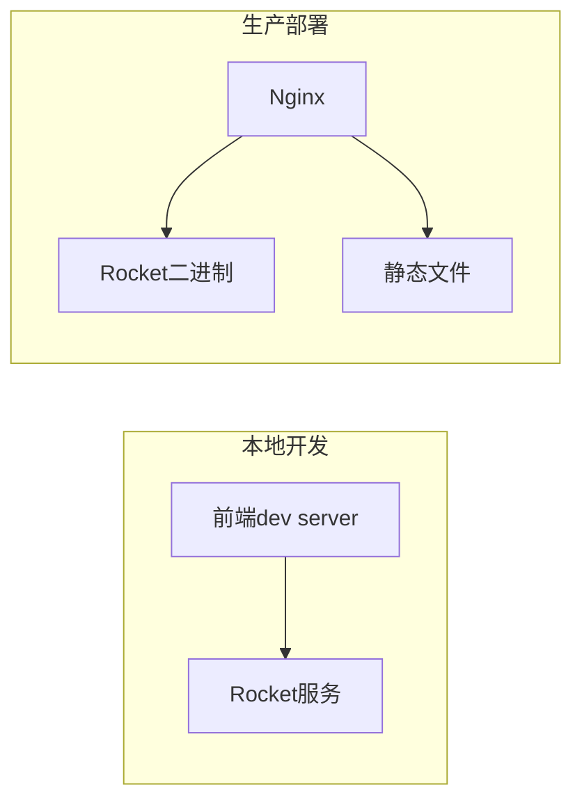

# 架构设计文档

## 系统架构概览
```mermaid
graph TD
    A[Rocket Server] --> B(API路由)
    A --> C(静态文件服务)
    B --> D[/api/health]
    B --> E[/api/user]
    B --> F[/api/data]
    C --> G[frontend/dist]
    H(Taro前端) --> I[状态管理]
    H --> J[API集成]
    H --> K[WP8样式]
    A --> L[中间件]
    L --> M(CORS配置)
    L --> N(请求日志)
```

## 核心模块说明

### 1. 后端服务模块
- **启动配置**：通过`main.rs`初始化Rocket实例
- **路由系统**：
  - 健康检查端点：`/api/health`
  - 用户数据端点：`/api/user`
  - 业务数据端点：`/api/data`
- **中间件**：
  - CORS配置：允许跨域请求
  - 请求日志：内置Fairing实现

### 2. 前端集成模块
- **状态管理**：
```javascript
// stores/app.js
const useStore = create((set) => ({
  user: null,
  fetchUser: async () => {
    const res = await fetch('/api/user');
    set({ user: await res.json() })
  }
}))
```
- **页面结构**：
  - 使用Taro标准页面模板
  - 集成WP8风格CSS变量

## API规范
| 端点 | 方法 | 请求参数 | 响应格式 |
|------|------|----------|----------|
| /api/health | GET | 无 | `{status: "ok"}` |
| /api/user | GET | 无 | `ApiResponse<User>` |
| /api/data | POST | JSON body | `ApiResponse<Data>` |

## 部署架构


## 安全设计
- CORS配置：
```rust
// cors.rs
Response::build()
    .header(Header::new("Access-Control-Allow-Origin", "*"))
    .header(Header::new("Access-Control-Allow-Methods", "*"))
```
- 请求限制：
  - 最大表单尺寸：2MB
  - 请求超时：30秒

## 性能优化
- 使用Rust异步运行时
- Release模式编译
- 前端资源压缩
- 浏览器缓存策略