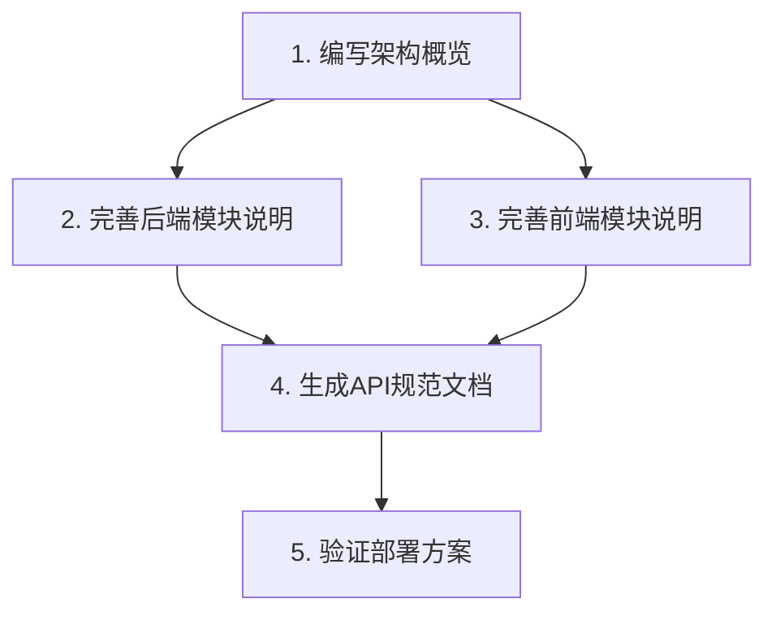

# 架构审查原子任务清单

## 任务依赖关系

## 原子任务列表

### 任务1：架构概览
- **输入契约**：ALIGNMENT/CONSENSUS文档、main.rs
- **交付物**：架构图源文件（.mmd）
- **验收标准**：
  - 准确反映当前系统分层
  - 包含所有核心组件交互关系

### 任务2：后端模块说明
- **输入契约**：routes/api.rs、models/*
- **交付物**：后端模块说明章节
- **验收标准**：
  - 覆盖所有已实现的路由
  - 包含中间件配置说明

### 任务3：前端模块说明
- **输入契约**：frontend/src/stores/*
- **交付物**：前端集成说明章节
- **验收标准**：
  - 完整说明状态管理机制
  - 包含WP8样式实现细节

### 任务4：API规范生成
- **输入契约**：routes/api.rs、models/response.rs
- **交付物**：API_REFERENCE.md
- **验收标准**：
  - 符合OpenAPI规范
  - 包含所有端点测试用例

### 任务5：部署验证
- **输入契约**：Rocket.toml、config/*
- **交付物**：DEPLOYMENT_GUIDE.md
- **验收标准**：
  - 包含本地/生产环境部署步骤
  - 验证Nginx配置有效性

## 任务优先级
1. 架构概览（基础框架）
2. 模块说明（功能实现）
3. API规范（接口定义）
4. 部署验证（运维准备）

## 依赖管理
- 使用项目现有Cargo/Webpack配置
- 保持与Rocket 0.5.0版本兼容
- 复用已有中间件实现