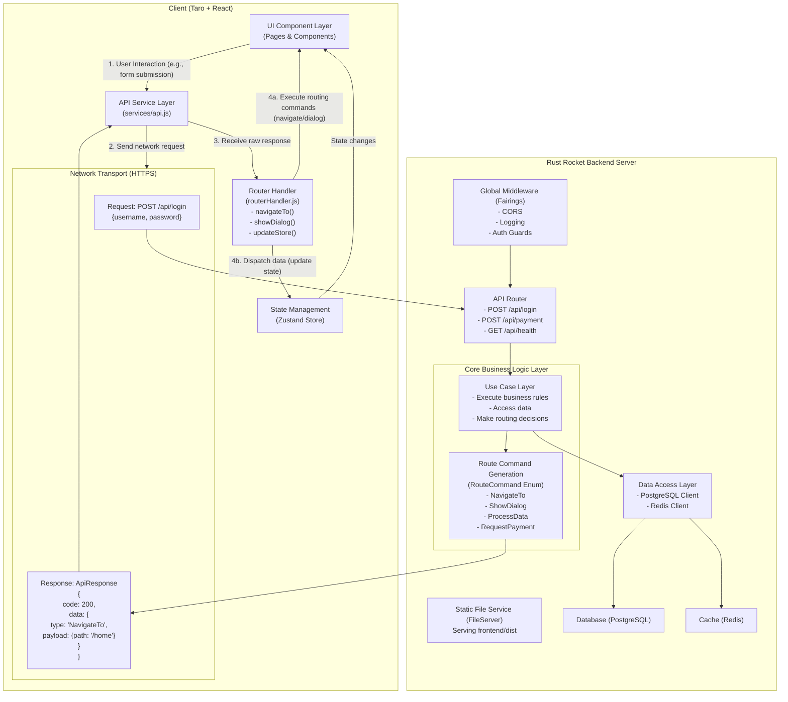

# Backend-Driven Routing Architecture Design

## Overview

Backend-driven routing is a modern frontend-backend interaction architecture that transfers control of business processes from the frontend to the backend, achieving true centralized business logic management. In this architecture, the frontend is no longer responsible for complex business decisions but acts as an "executor" that responds to routing commands sent by the backend.

## Core Philosophy

### Traditional Frontend-Driven vs Backend-Driven

**Traditional Frontend-Driven Mode**:
```javascript
// Frontend needs to handle complex business logic
if (loginResponse.success) {
  if (user.isFirstLogin) {
    navigateTo('/onboarding')
  } else if (user.hasUnfinishedOrder) {
    navigateTo('/payment')
  } else if (user.isVIP) {
    navigateTo('/vip-dashboard')
  } else {
    navigateTo('/home')
  }
}
```

**Backend-Driven Mode**:
```javascript
// Frontend only needs to execute backend commands
const response = await api.login(credentials)
routerHandler.execute(response.data.routeCommand)
```

### Architecture Benefits

1. **Centralized Business Logic**: All business rules are managed by the backend
2. **Multi-Platform Consistency**: H5, Mini-Programs, and Apps execute the same business processes
3. **Dynamic Process Control**: Backend can adjust user experience flows in real-time
4. **Reduced Frontend Complexity**: Frontend focuses on UI presentation and user interaction
5. **Easy Testing and Maintenance**: Business logic testing is centralized on the backend

## System Architecture Diagram



## Core Component Design

### 1. Route Commands (RouteCommand)

Route commands are the core protocol for backend-frontend communication, defining the types of operations the frontend should execute and related data.

```rust
#[derive(Debug, Serialize, Deserialize)]
#[serde(tag = "type", content = "payload")]
pub enum RouteCommand {
    /// Page navigation
    NavigateTo {
        path: String,
        params: Option<serde_json::Value>,
        replace: Option<bool>,
    },
    
    /// Show dialog/popup
    ShowDialog {
        dialog_type: DialogType,
        title: String,
        content: String,
        actions: Vec<DialogAction>,
    },
    
    /// Process data (update state)
    ProcessData {
        data_type: String,
        data: serde_json::Value,
        merge: Option<bool>,
    },
    
    /// Request payment
    RequestPayment {
        payment_info: PaymentInfo,
        callback_url: String,
    },
    
    /// Composite command (execute multiple commands in sequence)
    Sequence {
        commands: Vec<RouteCommand>,
    },
    
    /// Conditional command (decide which command to execute based on frontend state)
    Conditional {
        condition: String,
        if_true: Box<RouteCommand>,
        if_false: Option<Box<RouteCommand>>,
    },
}
```

### 2. Use Case Layer

The use case layer is the core of business logic, responsible for handling business rules and generating corresponding route commands.

```rust
pub trait UseCase<Input, Output> {
    async fn execute(&self, input: Input) -> Result<RouteCommand, UseCaseError>;
}

pub struct AuthUseCase {
    db_pool: Arc<DbPool>,
    redis_pool: Arc<RedisPool>,
}

impl UseCase<LoginRequest, LoginResponse> for AuthUseCase {
    async fn execute(&self, request: LoginRequest) -> Result<RouteCommand, UseCaseError> {
        // 1. Validate user credentials
        let user = self.authenticate_user(&request).await?;
        
        // 2. Create session
        let session = self.create_session(&user).await?;
        
        // 3. Determine next action
        let route_command = self.determine_next_action(&user).await?;
        
        Ok(route_command)
    }
}

impl AuthUseCase {
    async fn determine_next_action(&self, user: &User) -> Result<RouteCommand, UseCaseError> {
        if user.is_first_login {
            Ok(RouteCommand::NavigateTo {
                path: "/onboarding".to_string(),
                params: None,
                replace: Some(true),
            })
        } else if self.has_unfinished_order(user).await? {
            Ok(RouteCommand::NavigateTo {
                path: "/payment".to_string(),
                params: Some(json!({"order_id": user.last_order_id})),
                replace: Some(true),
            })
        } else {
            Ok(RouteCommand::Sequence {
                commands: vec![
                    RouteCommand::ProcessData {
                        data_type: "user".to_string(),
                        data: serde_json::to_value(user)?,
                        merge: Some(false),
                    },
                    RouteCommand::NavigateTo {
                        path: "/home".to_string(),
                        params: None,
                        replace: Some(true),
                    },
                ],
            })
        }
    }
}
```

### 3. Frontend Router Handler

The frontend router handler is responsible for parsing and executing route commands sent by the backend.

```javascript
class RouterHandler {
    constructor(store) {
        this.store = store
    }

    async execute(routeCommand) {
        switch (routeCommand.type) {
            case 'NavigateTo':
                return this.handleNavigateTo(routeCommand.payload)
            
            case 'ShowDialog':
                return this.handleShowDialog(routeCommand.payload)
            
            case 'ProcessData':
                return this.handleProcessData(routeCommand.payload)
            
            case 'RequestPayment':
                return this.handleRequestPayment(routeCommand.payload)
            
            case 'Sequence':
                return this.handleSequence(routeCommand.payload)
            
            case 'Conditional':
                return this.handleConditional(routeCommand.payload)
            
            default:
                console.warn('Unknown route command type:', routeCommand.type)
        }
    }

    async handleNavigateTo({ path, params, replace }) {
        const url = params ? `${path}?${new URLSearchParams(params)}` : path
        
        if (replace) {
            await Taro.redirectTo({ url })
        } else {
            await Taro.navigateTo({ url })
        }
    }

    async handleProcessData({ data_type, data, merge }) {
        switch (data_type) {
            case 'user':
                if (merge) {
                    this.store.updateUser(data)
                } else {
                    this.store.setUser(data)
                }
                break
            
            case 'userList':
                this.store.setUserList(data)
                break
            
            default:
                console.warn('Unknown data type:', data_type)
        }
    }

    async handleSequence({ commands }) {
        for (const command of commands) {
            await this.execute(command)
        }
    }
}
```

## Data Flow Details

### Complete User Login Flow

1. **User Interaction**: User enters username and password on the login page and clicks the login button

2. **API Call**: Frontend calls the login API
   ```javascript
   const response = await api.post('/api/auth/login', { username, password })
   ```

3. **Backend Processing**:
   - Router layer receives the request
   - Calls `AuthUseCase.execute()`
   - Validates user credentials
   - Creates user session
   - Determines next action based on user state
   - Generates corresponding `RouteCommand`

4. **Response Generation**:
   ```json
   {
     "code": 200,
     "message": "success",
     "data": {
       "type": "Sequence",
       "payload": {
         "commands": [
           {
             "type": "ProcessData",
             "payload": {
               "data_type": "user",
               "data": { "id": 1, "username": "admin", "email": "admin@example.com" },
               "merge": false
             }
           },
           {
             "type": "NavigateTo",
             "payload": {
               "path": "/home",
               "params": null,
               "replace": true
             }
           }
         ]
       }
     }
   }
   ```

5. **Frontend Execution**:
   - API service layer receives response
   - Passes `RouteCommand` to router handler
   - Router handler parses and executes command sequence:
     - Updates user state to Store
     - Navigates to home page

### Payment Flow Example

For complex payment flows, the backend can return different route commands based on different conditions:

```rust
async fn handle_payment_request(&self, request: PaymentRequest) -> Result<RouteCommand, Error> {
    let user = self.get_user(request.user_id).await?;
    
    if user.balance >= request.amount {
        // Sufficient balance, process directly
        self.process_payment(&request).await?;
        Ok(RouteCommand::NavigateTo {
            path: "/payment-success".to_string(),
            params: Some(json!({"order_id": request.order_id})),
            replace: Some(true),
        })
    } else {
        // Insufficient balance, guide to recharge
        Ok(RouteCommand::ShowDialog {
            dialog_type: DialogType::Confirm,
            title: "Insufficient Balance".to_string(),
            content: "Your balance is insufficient. Would you like to go to recharge?".to_string(),
            actions: vec![
                DialogAction {
                    text: "Cancel".to_string(),
                    action: None,
                },
                DialogAction {
                    text: "Recharge".to_string(),
                    action: Some(RouteCommand::NavigateTo {
                        path: "/recharge".to_string(),
                        params: Some(json!({"required_amount": request.amount - user.balance})),
                        replace: Some(false),
                    }),
                },
            ],
        })
    }
}
```

## Architecture Comparison Analysis

### Problems with Traditional Architecture

1. **Scattered Business Logic**: Both frontend and backend have business logic
2. **Multi-Platform Inconsistency**: H5 and mini-programs may have different business flows
3. **Maintenance Difficulties**: Business rule changes require modifying both frontend and backend
4. **Complex Testing**: Need to test business logic separately on frontend and backend

### Advantages of Backend-Driven Architecture

1. **Unified Business Control**: All business decisions are made on the backend
2. **Strong Consistency**: All platforms execute the same business processes
3. **Flexible Process Control**: Backend can dynamically adjust user experience
4. **Simplified Frontend Logic**: Frontend focuses on UI and interaction
5. **Centralized Testing Strategy**: Main business logic testing is completed on the backend

## Implementation Considerations

### 1. Progressive Migration

It's not recommended to refactor the entire system at once. A module-by-module approach is suggested:

1. First select a relatively independent functional module (such as user authentication)
2. Implement a complete backend-driven process
3. Validate effectiveness before gradually expanding to other modules

### 2. Error Handling Strategy

```rust
#[derive(Debug, Serialize, Deserialize)]
pub struct ErrorRouteCommand {
    pub error_code: String,
    pub error_message: String,
    pub fallback_command: Option<RouteCommand>,
}
```

### 3. Debugging and Monitoring

- Provide detailed route command logs in development environment
- Implement execution chain tracking for route commands
- Establish consistency validation mechanisms for frontend-backend route commands

### 4. Performance Considerations

- Use `Sequence` commands reasonably, avoid overly long command chains
- Cache frequently used route commands
- Implement batch execution optimization for route commands

## Summary

Backend-driven routing architecture is a future-oriented system design philosophy that achieves true unified business logic management by centralizing business control to the backend. This architecture is particularly suitable for:

- Multi-platform applications (H5, Mini-Programs, Apps)
- Complex business processes (payments, approvals, etc.)
- Products that need frequent user experience adjustments
- Systems with high consistency requirements

Through proper design and implementation, this architecture can significantly improve development efficiency, system maintainability, and user experience consistency.