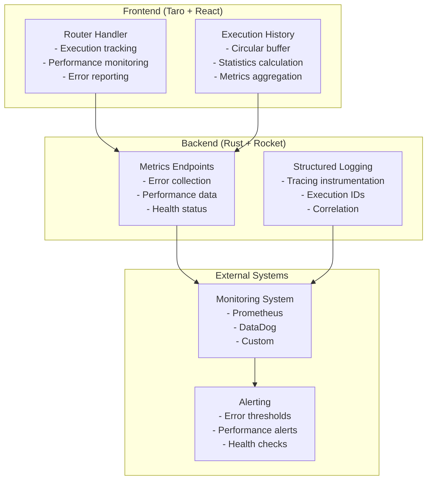

# Observability and Monitoring Guide

## Overview

This guide covers the comprehensive observability features introduced in the backend-driven routing architecture v2.0. These features provide deep insights into system behavior, performance monitoring, error tracking, and operational health.

## Architecture Overview

### Observability Components



## Frontend Observability

### Execution Tracking

Every route command execution is tracked with a unique execution ID and comprehensive metadata.

#### Configuration

```javascript
class RouterHandler {
    constructor(store) {
        this.store = store
        this.debugMode = process.env.NODE_ENV === 'development'
        this.executionHistory = [] // Circular buffer (max 100 entries)
        this.fallbackStack = []
    }
    
    // Generate unique execution ID
    generateExecutionId() {
        return Math.random().toString(36).substr(2, 9)
    }
}
```

#### Execution Metadata Collection

```javascript
async execute(routeCommand) {
    const executionId = this.generateExecutionId()
    const startTime = performance.now()
    
    if (this.debugMode) {
        console.group(`🚀 RouterHandler: Executing Command [${executionId}]`)
        console.log('Input:', routeCommand)
        console.time(`Execution Time [${executionId}]`)
    }
    
    try {
        // Execute command with tracking
        await this.executeCommand(routeCommand, executionId)
        
        const endTime = performance.now()
        const duration = endTime - startTime
        
        // Record successful execution
        this.recordExecution(executionId, routeCommand, 'success', null, { duration })
        
    } catch (error) {
        const endTime = performance.now()
        const duration = endTime - startTime
        
        // Record failed execution with error details
        this.recordExecution(executionId, routeCommand, 'error', error.message, { duration })
        
        // Report error in production
        if (process.env.NODE_ENV === 'production') {
            this.reportExecutionMetrics({
                executionId,
                commandType: routeCommand.type,
                error: error.message,
                duration,
                timestamp: new Date().toISOString(),
                userAgent: navigator.userAgent,
                url: window.location.href
            })
        }
        
        throw error
    } finally {
        if (this.debugMode) {
            console.timeEnd(`Execution Time [${executionId}]`)
            console.groupEnd()
        }
    }
}
```

### Performance Monitoring

#### Execution Statistics

```javascript
getExecutionStats() {
    const total = this.executionHistory.length
    const successful = this.executionHistory.filter(r => r.status === 'success').length
    const failed = this.executionHistory.filter(r => r.status === 'error').length
    
    const durations = this.executionHistory
        .filter(r => r.duration !== null)
        .map(r => r.duration)
    
    const avgDuration = durations.length > 0 
        ? durations.reduce((a, b) => a + b, 0) / durations.length 
        : 0
        
    const maxDuration = durations.length > 0 ? Math.max(...durations) : 0
    
    const commandTypes = {}
    this.executionHistory.forEach(record => {
        const type = record.commandType || 'unknown'
        commandTypes[type] = (commandTypes[type] || 0) + 1
    })
    
    return {
        total,
        successful,
        failed,
        successRate: total > 0 ? (successful / total * 100).toFixed(2) + '%' : '0%',
        avgDuration: Math.round(avgDuration * 100) / 100,
        maxDuration: Math.round(maxDuration * 100) / 100,
        commandTypes,
        lastExecution: this.executionHistory.length > 0 
            ? this.executionHistory[this.executionHistory.length - 1].timestamp 
            : null
    }
}
```

#### Usage Example

```javascript
// Get real-time statistics
const stats = routerHandler.getExecutionStats()
console.log('📊 Route Handler Statistics:', {
    'Success Rate': stats.successRate,
    'Average Duration': `${stats.avgDuration}ms`,
    'Total Commands': stats.total,
    'Command Distribution': stats.commandTypes
})

// Output example:
// 📊 Route Handler Statistics: {
//   'Success Rate': '94.7%',
//   'Average Duration': '245.3ms',
//   'Total Commands': 38,
//   'Command Distribution': {
//     'NavigateTo': 15,
//     'ProcessData': 12,
//     'Sequence': 8,
//     'ShowDialog': 3
//   }
// }
```

### Error Reporting

#### Automatic Error Reporting

Errors are automatically reported to the backend in production environments:

```javascript
async reportExecutionMetrics(record) {
    try {
        if (typeof fetch !== 'undefined') {
            await fetch('/api/metrics/route-command-error', {
                method: 'POST',
                headers: {
                    'Content-Type': 'application/json',
                },
                body: JSON.stringify({
                    executionId: record.executionId,
                    commandType: record.commandType,
                    error: record.error,
                    duration: record.duration,
                    timestamp: record.timestamp,
                    userAgent: record.userAgent,
                    url: record.url
                })
            }).catch(error => {
                console.warn('Unable to report error metrics:', error)
            })
        }
    } catch (error) {
        console.warn('Metrics reporting failed:', error)
    }
}
```

#### Error Categories and Handling

```javascript
// Error categorization for better monitoring
categorizeError(error) {
    if (error.message.includes('Navigation failed')) return 'navigation_error'
    if (error.message.includes('timeout')) return 'timeout_error'
    if (error.message.includes('network')) return 'network_error'
    if (error.message.includes('version')) return 'version_incompatibility'
    return 'unknown_error'
}

// Enhanced error reporting with categorization
async reportError(executionId, commandType, error, duration) {
    const errorCategory = this.categorizeError(error)
    const severity = this.determineErrorSeverity(error)
    
    await this.reportExecutionMetrics({
        executionId,
        commandType,
        error: error.message,
        errorCategory,
        severity,
        duration,
        timestamp: new Date().toISOString(),
        userAgent: navigator.userAgent,
        url: window.location.href,
        stackTrace: error.stack // Include for debugging
    })
}
```

## Backend Observability

### Structured Logging

#### Tracing Instrumentation

All critical functions are instrumented with tracing for detailed execution tracking:

```rust
use tracing::{info, warn, error, instrument};

impl AuthUseCase {
    /// Execute user login with comprehensive tracing
    #[instrument(skip_all, name = "execute_login")]
    pub async fn execute_login(&self, request: LoginRequest) -> UseCaseResult<LoginResult> {
        info!("Processing login request for user: {}", request.username);

        // 1. Authenticate user
        let user = match self.authenticate_user(&request).await? {
            Some(user) => {
                info!(user_id = %user.id, username = %user.username, "User authentication successful");
                user
            },
            None => {
                warn!("Login failed for user: {} - invalid credentials", request.username);
                return Err(UseCaseError::AuthenticationError("Invalid credentials".to_string()));
            }
        };

        // 2. Create session with tracking
        let session = self.create_session(&user).await.map_err(|e| {
            error!(user_id = %user.id, error = %e, "Failed to create session");
            UseCaseError::InternalError("Session creation failed".to_string())
        })?;

        info!(
            user_id = %user.id, 
            session_id = %session.id,
            "Login successful, session created"
        );

        Ok(LoginResult::new(user, session))
    }

    #[instrument(skip_all, name = "authenticate_user")]
    async fn authenticate_user(&self, request: &LoginRequest) -> UseCaseResult<Option<User>> {
        info!(username = %request.username, "Authenticating user credentials");
        
        // Implementation with detailed logging...
    }
}
```

#### Log Correlation with Execution IDs

```rust
// Generate correlation IDs for request tracking
#[instrument(skip_all, fields(correlation_id = %correlation_id))]
pub async fn handle_login(
    correlation_id: String,
    request: LoginRequest
) -> UseCaseResult<RouteCommand> {
    info!(correlation_id = %correlation_id, "Handling login request");
    
    match self.execute_login(request).await {
        Ok(login_result) => {
            info!(
                correlation_id = %correlation_id,
                user_id = %login_result.user.id,
                "Login completed successfully"
            );
            Ok(RouteCommandGenerator::generate_login_route_command(&login_result))
        }
        Err(e) => {
            error!(
                correlation_id = %correlation_id,
                error = %e,
                "Login failed"
            );
            Ok(RouteCommandGenerator::generate_error_route_command(&e.to_string(), None))
        }
    }
}
```

### Metrics Collection Endpoints

#### Error Metrics Endpoint

```rust
#[post("/api/metrics/route-command-error", data = "<metric>")]
#[instrument(skip_all, name = "receive_route_command_error_metric")]
pub async fn receive_route_command_error_metric(
    metric: Json<RouteCommandErrorMetric>,
) -> Json<ApiResponse<()>> {
    let metric = metric.into_inner();
    
    // Structured error logging with all context
    error!(
        execution_id = %metric.execution_id,
        command_type = %metric.command_type,
        error_message = %metric.error,
        duration = ?metric.duration,
        user_agent = %metric.user_agent,
        url = %metric.url,
        timestamp = %metric.timestamp,
        "Frontend route command execution error received"
    );
    
    // Trigger alerts based on error patterns
    if metric.command_type == "NavigateTo" && metric.error.contains("Navigation failed") {
        warn!(
            execution_id = %metric.execution_id,
            "High frequency navigation error detected - possible routing configuration issue"
        );
    }
    
    // Performance issue detection
    if let Some(duration) = metric.duration {
        if duration > 5000.0 { // Over 5 seconds
            warn!(
                execution_id = %metric.execution_id,
                command_type = %metric.command_type,
                duration = %duration,
                "Extremely slow route command execution detected"
            );
        }
    }
    
    Json(ApiResponse::with_toast((), "Error metric recorded"))
}
```

#### Performance Metrics Endpoint

```rust
#[post("/api/metrics/performance", data = "<metric>")]
#[instrument(skip_all, name = "receive_performance_metric")]
pub async fn receive_performance_metric(
    metric: Json<PerformanceMetric>,
) -> Json<ApiResponse<()>> {
    let metric = metric.into_inner();
    
    info!(
        metric_type = %metric.metric_type,
        value = %metric.value,
        tags = ?metric.tags,
        timestamp = %metric.timestamp,
        "Performance metric received"
    );
    
    // Performance threshold monitoring
    match metric.metric_type.as_str() {
        "route_command_duration" => {
            if metric.value > 3000.0 { // Over 3 seconds
                warn!(
                    duration = %metric.value,
                    command_type = ?metric.tags.get("command_type"),
                    "Long route command execution time detected"
                );
            }
        }
        "page_load_time" => {
            if metric.value > 5000.0 { // Over 5 seconds
                warn!(
                    load_time = %metric.value,
                    page = ?metric.tags.get("page"),
                    "Slow page load time detected"
                );
            }
        }
        _ => {}
    }
    
    Json(ApiResponse::with_toast((), "Performance metric recorded"))
}
```

### Health Monitoring

#### System Health Endpoint

```rust
#[post("/api/metrics/health")]
#[instrument(name = "get_system_health")]
pub async fn get_system_health() -> Json<ApiResponse<SystemHealthStatus>> {
    info!("System health check requested");
    
    // Check database connectivity
    let db_status = check_database_health().await;
    
    // Check Redis connectivity  
    let redis_status = check_redis_health().await;
    
    // Check route handler status
    let route_handler_status = check_route_handler_health().await;
    
    let overall_status = if db_status == "healthy" && 
                           redis_status == "healthy" && 
                           route_handler_status == "healthy" {
        "healthy"
    } else if db_status != "unhealthy" && 
              redis_status != "unhealthy" && 
              route_handler_status != "unhealthy" {
        "degraded"
    } else {
        "unhealthy"
    };
    
    let health_status = SystemHealthStatus {
        status: overall_status.to_string(),
        timestamp: chrono::Utc::now(),
        components: vec![
            ComponentHealth {
                name: "database".to_string(),
                status: db_status,
                last_check: chrono::Utc::now(),
                details: None,
            },
            ComponentHealth {
                name: "redis".to_string(),
                status: redis_status,
                last_check: chrono::Utc::now(),
                details: None,
            },
            ComponentHealth {
                name: "route_handler".to_string(),
                status: route_handler_status,
                last_check: chrono::Utc::now(),
                details: Some("All route commands executing normally".to_string()),
            },
        ],
        version: env!("CARGO_PKG_VERSION").to_string(),
    };
    
    if overall_status != "healthy" {
        warn!(
            overall_status = %overall_status,
            "System health check shows degraded or unhealthy status"
        );
    }
    
    Json(ApiResponse::success(health_status))
}
```

## Monitoring Integration

### Prometheus Integration

#### Custom Metrics Export

```rust
use prometheus::{Counter, Histogram, Gauge, Opts, Registry, Encoder, TextEncoder};

pub struct RouteCommandMetrics {
    pub commands_total: Counter,
    pub command_duration: Histogram,
    pub active_executions: Gauge,
}

impl RouteCommandMetrics {
    pub fn new() -> Self {
        let commands_total = Counter::new(
            "route_commands_total", 
            "Total number of route commands executed"
        ).unwrap();
        
        let command_duration = Histogram::with_opts(
            Opts::new("route_command_duration_seconds", "Route command execution duration")
                .buckets(vec![0.01, 0.05, 0.1, 0.25, 0.5, 1.0, 2.5, 5.0, 10.0])
        ).unwrap();
        
        let active_executions = Gauge::new(
            "route_command_active_executions",
            "Number of currently executing route commands"
        ).unwrap();
        
        Self {
            commands_total,
            command_duration,
            active_executions,
        }
    }
    
    pub fn record_execution(&self, command_type: &str, duration: f64, success: bool) {
        self.commands_total.inc();
        self.command_duration.observe(duration);
        
        // Additional labels for more detailed metrics
        // Implementation depends on specific Prometheus crate version
    }
}

// Metrics endpoint for Prometheus scraping
#[get("/metrics")]
pub fn prometheus_metrics() -> String {
    let encoder = TextEncoder::new();
    let metric_families = prometheus::gather();
    encoder.encode_to_string(&metric_families).unwrap()
}
```

### Custom Monitoring Dashboards

#### Key Metrics to Monitor

```yaml
# Example Prometheus rules
groups:
  - name: route_command_alerts
    rules:
      - alert: HighRouteCommandErrorRate
        expr: |
          (
            rate(route_commands_total{status="error"}[5m]) / 
            rate(route_commands_total[5m])
          ) > 0.05
        for: 2m
        labels:
          severity: warning
        annotations:
          summary: "High route command error rate detected"
          description: "Error rate is {{ $value | humanizePercentage }} for the last 5 minutes"
      
      - alert: SlowRouteCommandExecution
        expr: |
          histogram_quantile(0.95, rate(route_command_duration_seconds_bucket[5m])) > 3
        for: 1m
        labels:
          severity: warning
        annotations:
          summary: "Slow route command execution detected"
          description: "95th percentile execution time is {{ $value }}s"
      
      - alert: RouteCommandSystemUnhealthy
        expr: up{job="route-handler"} == 0
        for: 30s
        labels:
          severity: critical
        annotations:
          summary: "Route command system is down"
          description: "The route command system has been down for more than 30 seconds"
```

## Development and Debugging

### Development Mode Features

#### Enhanced Console Output

```javascript
// Development mode with rich console output
if (process.env.NODE_ENV === 'development') {
    console.group(`🚀 RouterHandler: Executing Command [${executionId}]`)
    console.log('📝 Command Details:', {
        type: routeCommand.type,
        payload: routeCommand.payload,
        timestamp: new Date().toISOString()
    })
    console.log('🔍 Execution Context:', {
        userAgent: navigator.userAgent,
        url: window.location.href,
        store: this.store
    })
    console.time(`⏱️ Execution Time [${executionId}]`)
}
```

#### Debug Utilities

```javascript
// Debug utilities for development
class RouterHandler {
    // ... existing code
    
    // Export execution history for debugging
    exportExecutionHistory() {
        const data = JSON.stringify(this.executionHistory, null, 2)
        const blob = new Blob([data], { type: 'application/json' })
        const url = URL.createObjectURL(blob)
        
        const a = document.createElement('a')
        a.href = url
        a.download = `router-execution-history-${Date.now()}.json`
        document.body.appendChild(a)
        a.click()
        document.body.removeChild(a)
        URL.revokeObjectURL(url)
    }
    
    // Simulate errors for testing
    simulateError(commandType = 'NavigateTo') {
        const mockCommand = {
            type: commandType,
            payload: { path: '/test-error' }
        }
        
        const mockError = new Error('Simulated error for testing')
        this.recordExecution(
            this.generateExecutionId(),
            mockCommand,
            'error',
            mockError.message,
            { duration: Math.random() * 1000 }
        )
    }
    
    // Performance testing
    async performanceTest(iterations = 100) {
        console.log(`🏃 Starting performance test with ${iterations} iterations`)
        
        const results = []
        for (let i = 0; i < iterations; i++) {
            const start = performance.now()
            await this.execute({
                type: 'ProcessData',
                payload: { data_type: 'test', data: { iteration: i } }
            })
            results.push(performance.now() - start)
        }
        
        const avg = results.reduce((a, b) => a + b) / results.length
        const min = Math.min(...results)
        const max = Math.max(...results)
        
        console.log('📊 Performance Test Results:', {
            iterations,
            averageTime: `${avg.toFixed(2)}ms`,
            minTime: `${min.toFixed(2)}ms`,
            maxTime: `${max.toFixed(2)}ms`
        })
        
        return { avg, min, max, results }
    }
}
```

### Production Monitoring

#### Log Analysis Queries

```bash
# Example log queries for production monitoring

# Find high-error rate periods
grep "route command execution error" /var/log/app.log | \
    awk '{print $1, $2}' | \
    sort | uniq -c | \
    sort -nr | head -10

# Analyze command execution times
grep "Execution Time" /var/log/app.log | \
    awk -F'[\\[\\]]' '{print $4}' | \
    awk '{sum+=$1; n++} END {print "Average:", sum/n "ms"}'

# Find most common error types
grep "error_message" /var/log/app.log | \
    jq -r '.error_message' | \
    sort | uniq -c | \
    sort -nr | head -10
```

#### Automated Alerting

```yaml
# Example alerting configuration
alerts:
  - name: high_error_rate
    condition: error_rate > 5%
    window: 5m
    actions:
      - slack: "#alerts"
      - email: "ops@company.com"
  
  - name: slow_execution
    condition: p95_duration > 3s
    window: 2m
    actions:
      - slack: "#performance"
  
  - name: system_unhealthy
    condition: health_status != "healthy"
    window: 30s
    actions:
      - pagerduty: "critical"
      - slack: "#incidents"
```

## Best Practices

### Observability Implementation Guidelines

1. **Structured Logging**
   - Use consistent field names across all logs
   - Include correlation IDs for request tracking
   - Log at appropriate levels (info, warn, error)

2. **Metrics Collection**
   - Collect both business and technical metrics
   - Use appropriate metric types (counters, histograms, gauges)
   - Include relevant labels for filtering and aggregation

3. **Error Tracking**
   - Categorize errors by type and severity
   - Include sufficient context for debugging
   - Implement error budgets and SLAs

4. **Performance Monitoring**
   - Track latency percentiles, not just averages
   - Monitor resource utilization
   - Set performance baselines and thresholds

5. **Health Checks**
   - Implement comprehensive health endpoints
   - Include dependency health in overall status
   - Provide actionable health information

## Troubleshooting Common Issues

### High Error Rates

```javascript
// Debugging high error rates
const errorAnalysis = routerHandler.getExecutionStats()
if (parseFloat(errorAnalysis.successRate) < 90) {
    console.warn('🚨 High error rate detected:', {
        successRate: errorAnalysis.successRate,
        totalCommands: errorAnalysis.total,
        errorTypes: routerHandler.getErrorDistribution()
    })
    
    // Export detailed history for analysis
    routerHandler.exportExecutionHistory()
}
```

### Performance Issues

```javascript
// Performance monitoring and alerting
const stats = routerHandler.getExecutionStats()
if (stats.avgDuration > 1000) { // Over 1 second average
    console.warn('🐌 Performance degradation detected:', {
        averageDuration: `${stats.avgDuration}ms`,
        maxDuration: `${stats.maxDuration}ms`,
        slowestCommands: routerHandler.getSlowestExecutions()
    })
    
    // Trigger performance test
    routerHandler.performanceTest(50)
}
```

### Version Compatibility Issues

```javascript
// Monitor version compatibility
const versionStats = routerHandler.getVersionStats()
if (versionStats.fallbackExecutions > versionStats.totalExecutions * 0.1) {
    console.warn('⚠️ High fallback usage detected:', {
        fallbackRate: `${(versionStats.fallbackExecutions / versionStats.totalExecutions * 100).toFixed(1)}%`,
        recommendation: 'Consider updating client version'
    })
}
```

This comprehensive observability system provides full visibility into the backend-driven routing system's operation, enabling proactive monitoring, rapid issue detection, and data-driven optimization decisions.