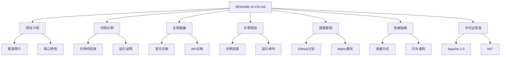

# README中文版本设计文档

## 整体架构



## 分层设计

### 内容层
保持原有README.md的完整结构，包括：
1. 标题和徽章
2. 项目简介
3. 代码示例
4. 文档链接
5. 示例项目说明
6. 获取帮助方式
7. 贡献指南
8. 许可证信息

### 翻译层
- 标题翻译：准确传达原意
- 技术术语：保持专业性
- 链接文本：适当本地化
- 保持格式：Markdown结构不变

### 质量保证层
- 术语一致性检查
- 链接有效性验证
- 格式完整性确认

## 接口契约

### 文件结构契约
- 输入：README.md (英文原版)
- 输出：README.zh-CN.md (中文版本)
- 格式：标准Markdown格式
- 编码：UTF-8

### 内容契约
- 所有超链接保持不变
- 所有代码块保持原样
- 所有文件路径保持不变
- 许可证文本保持原文引用

## 数据流向
```
README.md (英文)
    ↓
[内容分析]
    ↓
[逐段翻译]
    ↓
[术语统一]
    ↓
[格式验证]
    ↓
README.zh-CN.md (中文)
```

## 异常处理策略
- 术语冲突：建立术语表统一翻译
- 格式错误：对照原文检查修复
- 链接失效：保持原文链接不变
- 编码问题：统一使用UTF-8编码