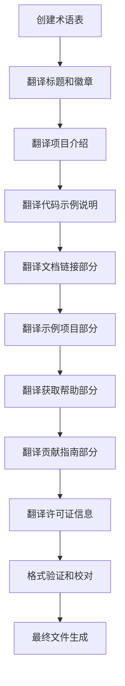

# README中文版本任务拆分

## 任务依赖图

## 原子任务列表

### 任务1：创建术语表
- **输入契约**：README.md原文
- **输出契约**：术语翻译对照表
- **实现约束**：保持技术准确性
- **验收标准**：包含所有技术术语的标准翻译

### 任务2：翻译标题和徽章
- **输入契约**：README.md头部内容
- **输出契约**：中文标题和徽章描述
- **实现约束**：保持徽章链接和格式
- **验收标准**：徽章显示正常，标题翻译准确

### 任务3：翻译项目介绍
- **输入契约**："Rocket is an async..."段落
- **输出契约**：中文项目介绍
- **实现约束**：突出四大特性：易用性、安全性、扩展性、速度
- **验收标准**：准确传达原文含义

### 任务4：翻译代码示例说明
- **输入契约**：代码示例及说明文字
- **输出契约**：中文说明+保持原代码
- **实现约束**：代码块不变，仅翻译说明文字
- **验收标准**：运行说明清晰准确

### 任务5：翻译文档链接部分
- **输入契约**：Documentation章节
- **输出契约**：中文文档介绍
- **实现约束**：保持所有URL链接不变
- **验收标准**：链接可正常访问

### 任务6：翻译示例项目部分
- **输入契约**：Examples章节
- **输出契约**：中文示例说明
- **实现约束**：保持命令和路径不变
- **验收标准**：命令可正常执行

### 任务7：翻译获取帮助部分
- **输入契约**：Getting Help章节
- **输出契约**：中文帮助信息
- **实现约束**：保持链接和联系方式
- **验收标准**：信息完整准确

### 任务8：翻译贡献指南部分
- **输入契约**：Contributing章节
- **输出契约**：中文贡献指南
- **实现约束**：保持链接和引用文件
- **验收标准**：流程清晰完整

### 任务9：翻译许可证信息
- **输入契约**：License章节
- **输出契约**：中文许可证说明
- **实现约束**：保持许可证原文引用
- **验收标准**：法律信息完整

### 任务10：格式验证和校对
- **输入契约**：完整翻译内容
- **输出契约**：格式正确的Markdown文件
- **实现约束**：符合标准Markdown规范
- **验收标准**：格式与原文一致

### 任务11：最终文件生成
- **输入契约**：校对后的翻译内容
- **输出契约**：README.zh-CN.md文件
- **实现约束**：UTF-8编码，Unix换行符
- **验收标准**：文件完整可正常显示