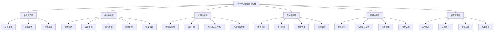
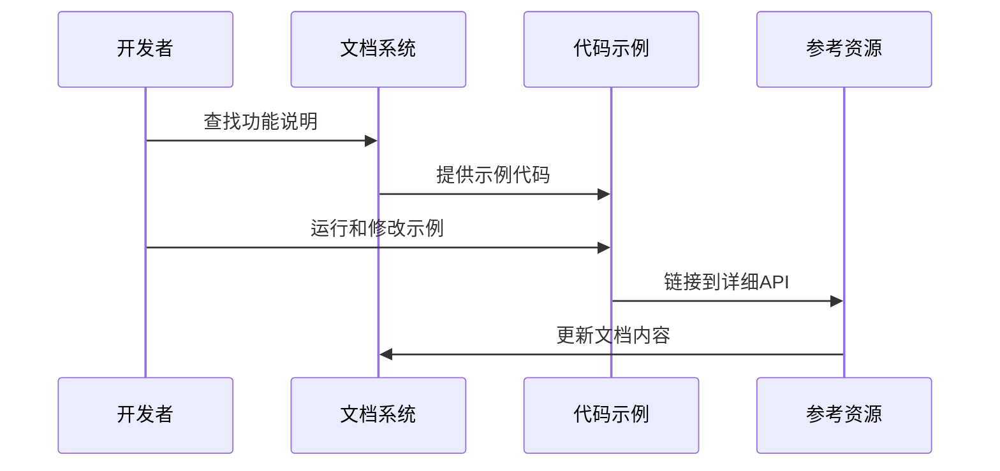

# Rocket功能说明书架构设计

## 整体架构图

## 分层设计

### 1. 架构总览层 (Architectural Overview)
**目标**：建立整体认知，理解设计哲学
- **设计理念**：安全、正确、开发者体验优先
- **架构模式**：模块化架构，核心+扩展设计
- **生命周期**：请求-响应完整流程

### 2. 核心功能层 (Core Features)
**目标**：掌握基础开发技能
- **路由系统**：属性宏路由、动态路径、HTTP方法
- **请求处理**：FromRequest守卫、数据验证、类型转换
- **响应生成**：Responder trait、内容协商、状态码
- **状态管理**：托管状态、请求局部状态、原子操作
- **错误处理**：错误捕获器、自定义错误类型

### 3. 扩展功能层 (Extension Features)
**目标**：利用生态系统的完整功能
- **数据库集成**：rocket_db_pools、连接池管理、ORM集成
- **模板引擎**：rocket_dyn_templates、Tera/Handlebars支持
- **WebSocket支持**：实时通信、消息广播
- **TLS/SSL配置**：HTTPS支持、证书管理

### 4. 实战指导层 (Practical Guide)
**目标**：从零开始构建生产级应用
- **快速入门**：最小可运行示例
- **项目结构**：推荐的代码组织方式
- **配置管理**：环境配置、secrets管理
- **测试策略**：单元测试、集成测试、端到端测试

### 5. 高级主题层 (Advanced Topics)
**目标**：专家级使用和架构设计
- **性能优化**：基准测试、内存优化、并发调优
- **安全最佳实践**：认证授权、CSRF防护、数据验证
- **部署指南**：容器化、反向代理、负载均衡
- **监控运维**：日志收集、指标监控、健康检查

### 6. 参考资源层 (Reference Resources)
**目标**：快速查找和故障排除
- **API参考**：完整trait和类型文档
- **示例项目**：可运行的完整项目
- **常见问题**：故障排查指南
- **版本更新**：升级指南和兼容性说明

## 接口契约定义

### 文档接口标准
- **格式规范**：Markdown + Mermaid图表 + 代码块
- **版本控制**：支持语义化版本追踪
- **交叉引用**：内部链接和外部资源引用
- **代码示例**：完整可运行的Rust代码

### 内容深度标准
- **入门级**：概念解释 + 简单示例
- **进阶级**：详细配置 + 最佳实践
- **专家级**：源码分析 + 架构设计

### 更新维护机制
- **变更追踪**：版本差异对比工具
- **贡献指南**：社区参与机制
- **质量检查**：内容准确性和时效性验证

## 数据流向设计

## 异常处理策略

### 文档质量控制
- **准确性验证**：代码示例自动测试
- **完整性检查**：功能覆盖度评估
- **时效性维护**：定期更新版本信息

### 用户支持机制
- **反馈收集**：GitHub issues集成
- **社区支持**：讨论区和聊天频道
- **错误报告**：问题追踪和修复流程