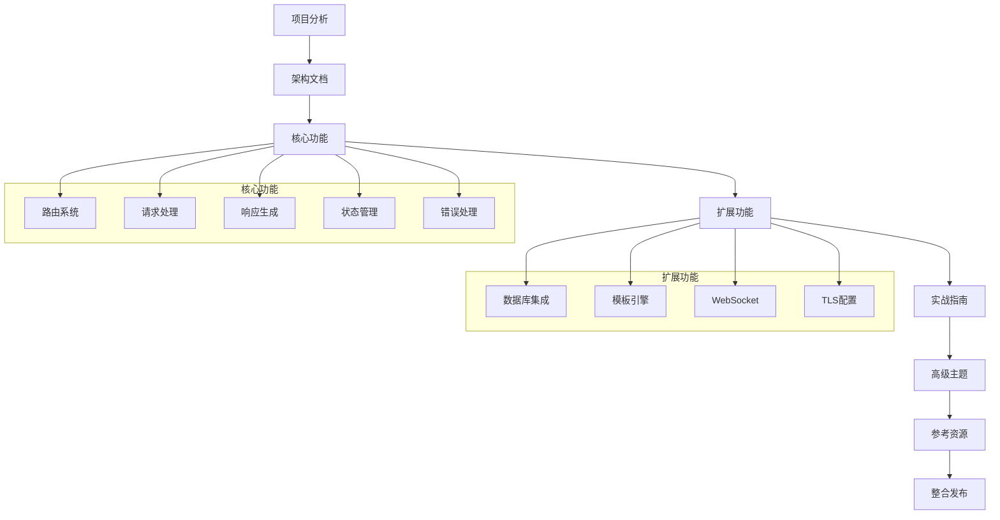

# Rocket功能说明书任务拆分

## 任务依赖图

## 原子任务列表

### 任务1：项目深度分析
- **输入契约**：完整项目源码、文档、示例
- **输出契约**：项目结构分析报告
- **实现约束**：不修改源码，仅分析
- **验收标准**：准确识别所有模块和依赖关系

### 任务2：架构总览文档
- **输入契约**：项目分析结果
- **输出契约**：架构设计理念文档
- **实现约束**：技术准确性，易于理解
- **验收标准**：涵盖设计哲学和架构模式

### 任务3：路由系统详解
- **输入契约**：路由相关源码和文档
- **输出契约**：路由系统完整说明
- **实现约束**：包含基础到高级用法
- **验收标准**：提供完整代码示例

### 任务4：请求处理机制
- **输入契约**：FromRequest、Data等源码
- **输出契约**：请求处理流程说明
- **实现约束**：包含守卫机制和验证
- **验收标准**：可运行的验证示例

### 任务5：响应生成系统
- **输入契约**：Responder trait相关源码
- **输出契约**：响应生成完整指南
- **实现约束**：包含所有响应类型
- **验收标准**：覆盖JSON、HTML、文件等

### 任务6：状态管理详解
- **输入契约**：状态管理相关API
- **输出契约**：状态管理最佳实践
- **实现约束**：包含所有状态类型
- **验收标准**：线程安全和性能考虑

### 任务7：错误处理机制
- **输入契约**：错误处理相关源码
- **输出契约**：错误处理策略指南
- **实现约束**：包含自定义错误
- **验收标准**：完整的错误处理示例

### 任务8：数据库集成指南
- **输入契约**：rocket_db_pools源码
- **输出契约**：数据库集成完整指南
- **实现约束**：包含SQL和NoSQL
- **验收标准**：完整的CRUD示例

### 任务9：模板引擎使用
- **输入契约**：rocket_dyn_templates源码
- **输出契约**：模板引擎使用指南
- **实现约束**：包含Tera和Handlebars
- **验收标准**：完整的模板示例

### 任务10：WebSocket支持
- **输入契约**：WebSocket扩展源码
- **输出契约**：实时通信指南
- **实现约束**：包含聊天和广播
- **验收标准**：可运行的WebSocket示例

### 任务11：TLS/SSL配置
- **输入契约**：TLS相关配置和源码
- **输出契约**：HTTPS配置指南
- **实现约束**：包含证书管理
- **验收标准**：生产级TLS配置

### 任务12：测试策略指南
- **输入契约**：测试框架源码
- **输出契约**：完整测试指南
- **实现约束**：包含单元和集成测试
- **验收标准**：测试覆盖率示例

### 任务13：性能优化指南
- **输入契约**：性能相关特性和配置
- **输出契约**：性能优化最佳实践
- **实现约束**：包含基准测试
- **验收标准**：性能提升示例

### 任务14：部署指南
- **输入契约**：部署相关文档和配置
- **输出契约**：生产部署完整指南
- **实现约束**：包含容器化和云部署
- **验收标准**：可复制的部署流程

### 任务15：监控运维指南
- **输入契约**：监控和日志相关特性
- **输出契约**：运维监控指南
- **实现约束**：包含日志和指标
- **验收标准**：完整的监控方案

### 任务16：版本更新指南
- **输入契约**：版本历史和变更记录
- **输出契约**：升级迁移指南
- **实现约束**：包含兼容性说明
- **验收标准**：平滑升级流程

### 任务17：常见问题解答
- **输入契约**：GitHub issues、FAQ等
- **输出契约**：问题排查指南
- **实现约束**：按问题分类整理
- **验收标准**：可搜索的问题库

### 任务18：示例项目集
- **输入契约**：所有示例项目
- **输出契约**：二次开发模板
- **实现约束**：按复杂度分级
- **验收标准**：完整的项目模板

### 任务19：API参考手册
- **输入契约**：所有公共API
- **输出契约**：快速参考手册
- **实现约束**：按功能分类
- **验收标准**：可搜索的API索引

### 任务20：整合发布
- **输入契约**：所有文档和示例
- **输出契约**：完整的功能说明书
- **实现约束**：统一格式和风格
- **验收标准**：完整的导航系统