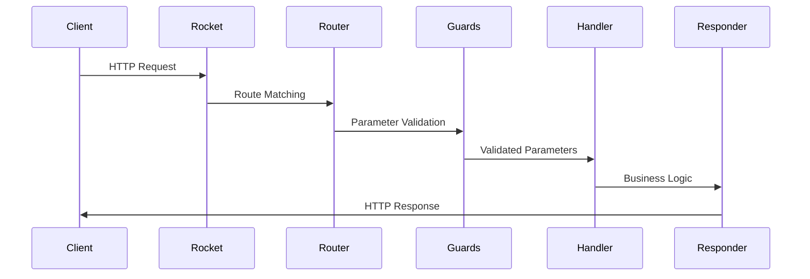
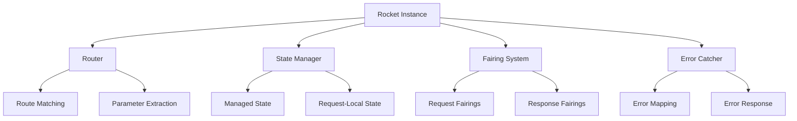

# Rocket架构总览

## 设计理念

Rocket的设计哲学建立在三个核心原则上：**安全正确性**、**开发者体验**和**零成本抽象**。这些原则贯穿于整个框架的设计和实现中。

### 安全正确性优先

Rocket将类型安全作为首要考虑，通过Rust的强类型系统确保在编译时捕获尽可能多的错误。这种设计带来了以下优势：

- **编译时错误检测**：路由冲突、参数类型不匹配等问题在编译时就能发现
- **内存安全保证**：利用Rust的所有权系统，避免常见的内存错误
- **并发安全**：通过Send/Sync trait确保线程安全

### 开发者体验至上

Rocket通过声明式编程模型和丰富的宏系统，极大简化了Web开发的复杂度：

- **声明式路由**：使用属性宏定义路由，直观且易于维护
- **自动参数提取**：通过FromRequest trait自动处理请求参数
- **智能响应生成**：Responder trait提供灵活的响应构建方式

### 零成本抽象

Rocket的抽象不会引入运行时开销，确保高性能：

- **静态分发**：编译时确定路由匹配，运行时零开销
- **内联优化**：关键路径函数会被编译器内联
- **最小运行时**：核心库仅包含必要的运行时组件

## 架构模式

Rocket采用**模块化架构**，将功能划分为核心模块和扩展模块，实现了高度的可扩展性。

### 核心架构

```
Rocket Core
├── Routing System
├── Request Handling
├── Response Generation
├── State Management
└── Error Handling
```

### 扩展架构

```
Rocket Extensions
├── Database Integration
├── Template Engines
├── WebSocket Support
├── TLS/SSL Support
└── Custom Fairings
```

### 非单体设计

Rocket坚持非单体设计原则：

- **最小核心**：仅包含Web框架的基础功能
- **可选扩展**：通过Cargo features启用额外功能
- **生态系统**：通过社区驱动的扩展库提供丰富功能

## 请求-响应生命周期

Rocket的请求处理遵循严格的生命周期，每个阶段都有明确的职责和扩展点。

### 生命周期阶段



### 详细流程

#### 1. 路由匹配 (Routing)
- **输入**：HTTP请求（方法、路径、头信息）
- **处理**：根据路由表匹配对应的处理器
- **输出**：匹配的路由处理器和参数

#### 2. 参数验证 (Validation)
- **输入**：原始请求参数
- **处理**：通过FromRequest trait进行类型转换和验证
- **输出**：验证后的强类型参数

#### 3. 业务处理 (Handling)
- **输入**：验证后的参数和状态
- **处理**：执行应用的业务逻辑
- **输出**：业务处理结果

#### 4. 响应生成 (Response)
- **输入**：业务处理结果
- **处理**：通过Responder trait生成HTTP响应
- **输出**：完整的HTTP响应

## 核心组件交互

### Rocket实例生命周期

Rocket实例经历三个主要阶段：

```rust
// 1. 构建阶段 (Build)
let rocket = rocket::build()
    .mount("/", routes![index])
    .manage(Database::new());

// 2. 点火阶段 (Ignite)
let rocket = rocket.ignite().await?;

// 3. 运行阶段 (Launch)
rocket.launch().await?;
```

### 组件协作模型



### 状态管理架构

Rocket提供两种主要的状态管理机制：

#### 托管状态 (Managed State)
- **生命周期**：与Rocket实例相同
- **访问方式**：通过&State<T>获取
- **适用场景**：数据库连接池、配置信息

#### 请求局部状态 (Request-Local State)
- **生命周期**：单个请求
- **访问方式**：通过Request::local_cache
- **适用场景**：请求级别的缓存、中间结果

## 扩展机制

### Fairings系统

Fairings是Rocket的结构化中间件系统，提供以下扩展点：

```rust
#[rocket::async_trait]
trait Fairing {
    async fn on_ignite(&self, rocket: Rocket<Build>) -> Result<Rocket<Build>, Rocket<Build>>;
    async fn on_request(&self, request: &mut Request<'_>, data: &mut Data<'_>);
    async fn on_response<'r>(&self, request: &'r Request<'_>, response: &mut Response<'r>);
}
```

### 扩展类型

- **请求Fairings**：请求预处理、日志记录、认证
- **响应Fairings**：响应后处理、头信息添加、压缩
- **启动Fairings**：初始化检查、配置验证

## 性能特征

### 编译时优化

Rocket在编译时进行大量优化：

- **路由静态化**：将路由表编译为高效的匹配结构
- **类型擦除**：消除运行时类型检查开销
- **内联展开**：关键路径函数自动内联

### 运行时特性

- **异步支持**：基于async/await的异步处理
- **连接池**：内置HTTP连接池和数据库连接池
- **缓存机制**：编译时模板缓存和静态资源缓存

### 基准测试

Rocket在TechEmpower基准测试中表现出色：
- **JSON序列化**：排名前列的Rust框架
- **数据库查询**：高效的连接池利用
- **模板渲染**：预编译模板带来零运行时开销

## 安全模型

### 类型安全

Rocket利用Rust的类型系统提供多层安全保障：

- **路由安全**：编译时验证路由参数类型
- **数据验证**：通过FromRequest trait强制验证
- **状态安全**：线程安全的状态管理

### 常见漏洞防护

Rocket默认提供以下安全保护：

- **路径遍历**：自动验证和清理路径参数
- **HTTP头注入**：自动转义响应头
- **JSON注入**：使用serde_json的自动转义

### 认证授权

Rocket提供灵活的认证授权机制：

- **守卫机制**：通过FromRequest实现认证守卫
- **角色权限**：基于类型的权限检查
- **Session管理**：安全的会话状态管理