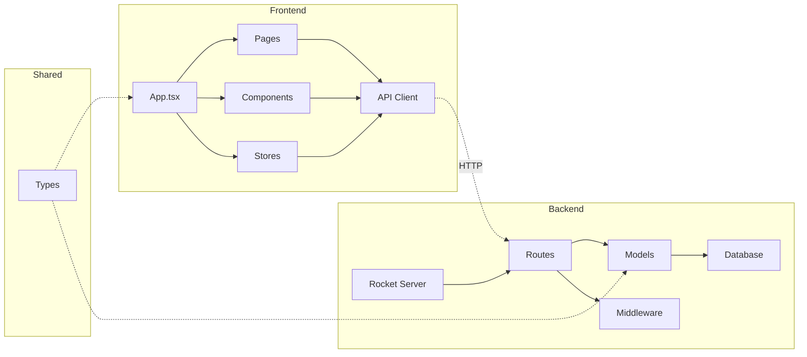
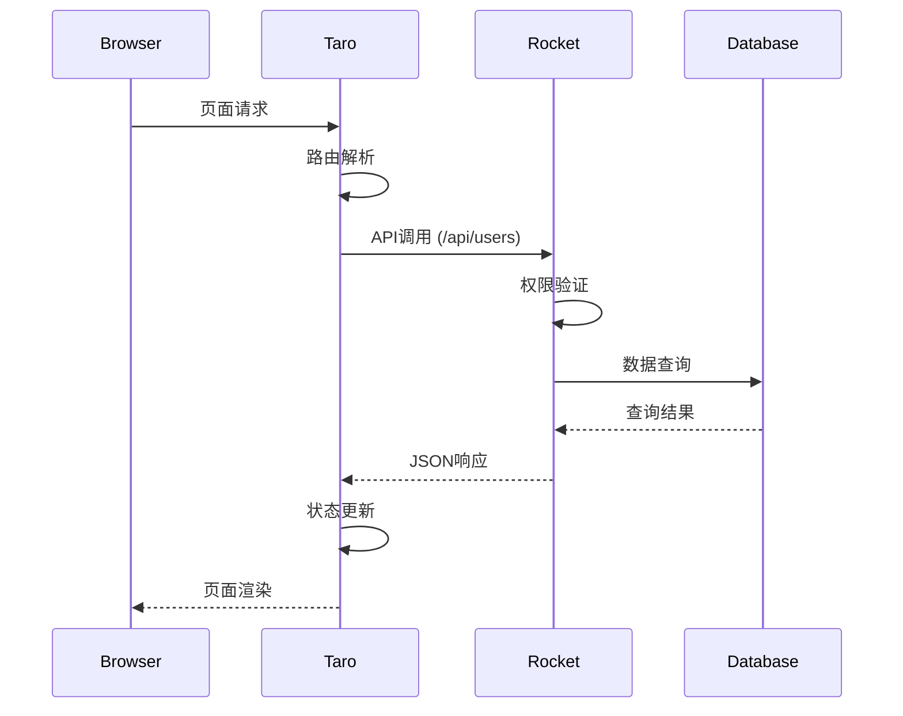

# Taro + Rocket 单仓库集成方案 - 系统架构设计

## 整体架构图

```mermaid
graph TB
    subgraph "开发环境"
        A[Taro Dev Server] -->|热重载| B[Frontend Source]
        C[Rocket Dev Server] -->|API| D[Rust Backend]
    end
    
    subgraph "构建流程"
        E[build.rs] -->|触发| F[Taro Build]
        F -->|构建产物| G[Static Files]
        G -->|Web| H[web/]
        G -->|H5| I[h5/]
        G -->|WeApp| J[weapp/]
    end
    
    subgraph "运行时"
        K[Rocket Server] -->|静态文件| L[/static/*]
        K -->|API路由| M[/api/*]
        L -->|Web| N[index.html]
        L -->|H5| O[index.html]
    end
    
    subgraph "客户端"
        P[Web Browser] -->|HTTP| K
        Q[Mobile H5] -->|HTTP| K
        R[WeChat MiniApp] -->|API| K
    end
```

## 分层设计

### 1. 表现层 (Presentation Layer)

#### Web端
- **技术**: React + Taro 3.x
- **路由**: React Router (Web版)
- **样式**: Tailwind CSS
- **状态**: Zustand

#### H5端
- **技术**: React + Taro 3.x
- **路由**: Taro路由系统
- **样式**: Tailwind CSS (移动端适配)
- **状态**: Zustand

#### 小程序端
- **技术**: React + Taro 3.x
- **路由**: 小程序原生路由
- **样式**: Taro样式系统
- **状态**: Zustand

### 2. API网关层 (API Gateway Layer)

#### Rocket路由配置
```rust
// 静态文件服务
.mount("/", rocket_contrib::serve::StaticFiles::new("static/web", None))
.mount("/h5", rocket_contrib::serve::StaticFiles::new("static/h5", None))

// API路由
.mount("/api", routes![
    auth_routes::login,
    user_routes::get_users,
    user_routes::get_user,
    // ... 其他路由
])
```

#### CORS配置
```rust
.use_(rocket_cors::CorsOptions::default()
    .allowed_origins(AllowedOrigins::all())
    .to_cors()?)
```

### 3. 业务逻辑层 (Business Logic Layer)

#### API模块结构
```rust
// src/api/mod.rs
pub mod auth_routes;
pub mod user_routes;
pub mod common;

// src/models/mod.rs
pub mod user;
pub mod response;
```

#### 统一响应格式
```rust
#[derive(Serialize)]
pub struct ApiResponse<T> {
    pub code: i32,
    pub message: String,
    pub data: Option<T>,
}
```

### 4. 数据访问层 (Data Access Layer)

#### 保持现有架构
- 复用现有Rocket数据库集成
- 支持SQLite/PostgreSQL切换
- 使用Rocket的State管理

## 模块依赖关系图



## 接口契约定义

### 1. 前端API客户端

#### API封装 (frontend/src/utils/api.ts)
```typescript
interface ApiResponse<T> {
  code: number;
  message: string;
  data: T;
}

class ApiClient {
  private baseURL = '/api';
  
  async get<T>(path: string): Promise<T> {
    const response = await fetch(`${this.baseURL}${path}`);
    const result: ApiResponse<T> = await response.json();
    return result.data;
  }
  
  async post<T>(path: string, data: any): Promise<T> {
    // POST实现...
  }
}

export const api = new ApiClient();
```

#### 状态管理 (frontend/src/stores/user.ts)
```typescript
interface UserState {
  user: User | null;
  login: (username: string, password: string) => Promise<void>;
  logout: () => void;
}

export const useUserStore = create<UserState>((set) => ({
  user: null,
  login: async (username, password) => {
    const user = await api.post<User>('/auth/login', { username, password });
    set({ user });
  },
  logout: () => set({ user: null }),
}));
```

### 2. 后端API规范

#### 认证接口
```rust
#[post("/auth/login", data = "<login>")]
async fn login(login: Json<LoginRequest>) -> Json<ApiResponse<User>> {
    // 实现...
}

#[post("/auth/logout")]
async fn logout() -> Json<ApiResponse<()>> {
    // 实现...
}
```

#### 用户接口
```rust
#[get("/users")]
async fn get_users() -> Json<ApiResponse<Vec<User>>> {
    // 实现...
}

#[get("/users/<id>")]
async fn get_user(id: i32) -> Json<ApiResponse<User>> {
    // 实现...
}
```

## 数据流向图



## 异常处理策略

### 1. 前端异常处理

#### 网络错误处理
```typescript
class ApiError extends Error {
  constructor(public code: number, message: string) {
    super(message);
  }
}

const handleApiError = (error: any) => {
  if (error instanceof ApiError) {
    switch (error.code) {
      case 401:
        // 未授权，跳转登录
        break;
      case 404:
        // 资源不存在
        break;
      default:
        // 通用错误提示
    }
  }
};
```

#### 小程序错误处理
```typescript
// 小程序专用错误处理
const handleWeappError = (error: any) => {
  wx.showToast({
    title: error.message || '操作失败',
    icon: 'none'
  });
};
```

### 2. 后端异常处理

#### 统一错误响应
```rust
#[catch(404)]
fn not_found() -> Json<ApiResponse<()>> {
    Json(ApiResponse {
        code: 404,
        message: "资源不存在".to_string(),
        data: None,
    })
}

#[catch(500)]
fn internal_error() -> Json<ApiResponse<()>> {
    Json(ApiResponse {
        code: 500,
        message: "服务器内部错误".to_string(),
        data: None,
    })
}
```

#### 业务异常处理
```rust
#[derive(Debug)]
pub enum BusinessError {
    UserNotFound,
    InvalidCredentials,
    DatabaseError(String),
}

impl<'r> Responder<'r, 'static> for BusinessError {
    fn respond_to(self, _: &'r Request<'_>) -> response::Result<'static> {
        let (code, message) = match self {
            BusinessError::UserNotFound => (404, "用户不存在"),
            BusinessError::InvalidCredentials => (401, "用户名或密码错误"),
            BusinessError::DatabaseError(_) => (500, "数据库错误"),
        };
        
        Json(ApiResponse {
            code,
            message: message.to_string(),
            data: None,
        }).respond_to(_)
    }
}
```

## 配置管理

### 1. 环境变量配置

#### .env模板
```bash
# Rocket配置
ROCKET_PORT=8000
ROCKET_ENV=development

# 数据库配置
DATABASE_URL=sqlite://rocket.db

# Taro配置
TARO_APP_ID=touristappid
TARO_API_URL=http://localhost:8000/api
```

### 2. Taro环境配置

#### 开发环境 (frontend/config/dev.js)
```javascript
module.exports = {
  env: {
    NODE_ENV: '"development"',
    API_URL: '"http://localhost:8000/api"',
  },
  defineConstants: {},
  mini: {},
  h5: {
    devServer: {
      port: 3000,
      proxy: {
        '/api': 'http://localhost:8000',
      },
    },
  },
};
```

#### 生产环境 (frontend/config/prod.js)
```javascript
module.exports = {
  env: {
    NODE_ENV: '"production"',
    API_URL: '"/api"',
  },
  defineConstants: {},
  mini: {},
  h5: {
    publicPath: '/',
    staticDirectory: 'static',
    webpackChain(chain) {
      chain.plugin('analyzer')
        .use(require('webpack-bundle-analyzer').BundleAnalyzerPlugin, []);
    },
  },
};
```

## 性能优化策略

### 1. 前端优化
- **代码分割**: 按路由和组件分割
- **懒加载**: 图片和组件懒加载
- **缓存策略**: API响应缓存
- **压缩**: 生产环境启用Gzip压缩

### 2. 后端优化
- **静态文件缓存**: 设置Cache-Control
- **ETag支持**: 浏览器缓存验证
- **Gzip压缩**: 响应内容压缩
- **连接池**: 数据库连接池优化

### 3. 构建优化
- **增量构建**: 只构建变更部分
- **并行构建**: 三端并行构建
- **缓存复用**: 依赖缓存
- **产物优化**: Tree Shaking和代码压缩