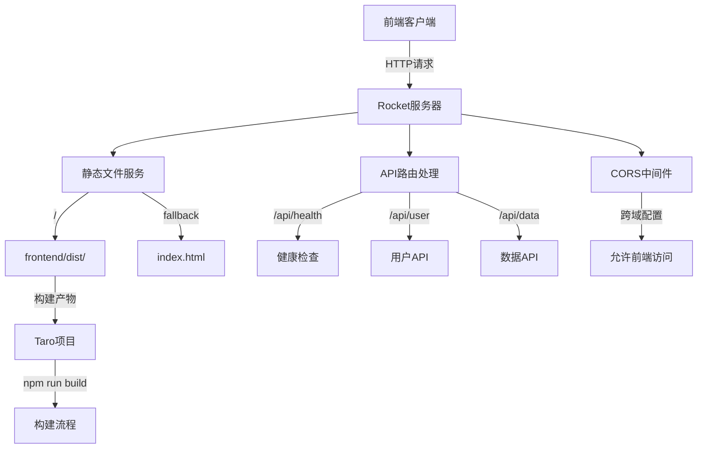
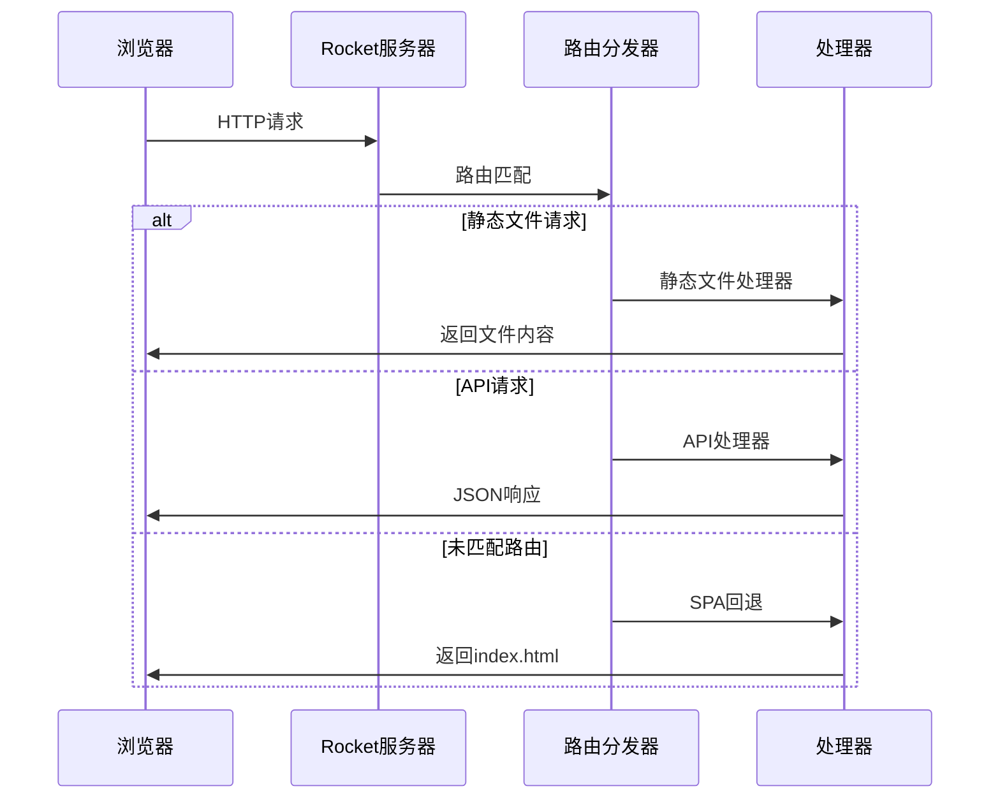

# 任务3: Rocket配置更新 - 系统架构设计

## 整体架构图



## 分层设计

### 1. 服务层 (Service Layer)
```
Rocket Server
├── 服务启动配置
├── 中间件栈
├── 路由分发
└── 错误处理
```

### 2. 路由层 (Route Layer)
```
路由模块
├── 静态文件路由 (/*)
├── API路由 (/api/*)
├── 健康检查 (/health)
└── 回退路由 (SPA支持)
```

### 3. 中间件层 (Middleware Layer)
```
中间件栈
├── CORS处理
├── 日志记录
├── 请求解析
└── 响应处理
```

## 核心组件设计

### 1. 主服务组件
**文件**: `src/main.rs`
- **职责**: 服务启动和配置
- **依赖**: 所有路由模块和中间件
- **配置**: 端口、地址、环境变量

### 2. 路由模块
**文件**: `src/routes/mod.rs`
- **职责**: 路由注册和组织
- **子模块**:
  - `src/routes/api.rs` - API路由
  - `src/routes/static.rs` - 静态文件路由

### 3. CORS中间件
**文件**: `src/fairings/cors.rs`
- **职责**: 跨域请求处理
- **配置**: 允许来源、方法、头部

### 4. 响应模型
**文件**: `src/models/response.rs`
- **职责**: API响应标准化
- **结构**: 统一响应格式

## 接口契约定义

### API接口规范

#### 统一响应格式
```rust
#[derive(Serialize)]
struct ApiResponse<T> {
    code: u16,
    message: String,
    data: Option<T>,
}
```

#### 健康检查端点
- **路径**: `GET /api/health`
- **响应**: `{"code": 200, "message": "OK", "data": null}`

#### 用户API端点
- **路径**: `GET /api/user`
- **响应**: `{"code": 200, "message": "Success", "data": {"id": 1, "name": "User"}}`

### 静态文件服务
- **根路径**: `/` → `frontend/dist/`
- **回退路径**: 所有未匹配路径返回 `index.html`（SPA支持）
- **缓存策略**: 生产环境缓存，开发环境无缓存

## 数据流向图



## 配置管理

### 环境配置
**文件**: `Rocket.toml`
```toml
[default]
address = "0.0.0.0"
port = 8000

[default.static_files]
root = "frontend/dist"

[development]
log_level = "debug"

[production]
log_level = "info"
```

### 依赖配置
**文件**: `Cargo.toml`
```toml
[dependencies]
rocket = "0.5"
rocket_cors = "0.6"
serde = { version = "1.0", features = ["derive"] }
serde_json = "1.0"
```

## 异常处理策略

### 错误分类
1. **404错误**: 路由未找到，返回SPA回退
2. **500错误**: 服务器内部错误，返回JSON错误响应
3. **CORS错误**: 跨域请求被拒绝，返回适当CORS头部

### 错误响应格式
```rust
#[derive(Serialize)]
struct ErrorResponse {
    code: u16,
    message: String,
    error: String,
}
```

## 与现有系统集成

### 兼容性设计
- **保持现有**: examples目录结构不变
- **新增功能**: 新增独立服务文件
- **构建集成**: 前端构建产物自动部署
- **开发流程**: 前后端并行开发

### 构建流程集成
```bash
# 开发模式
1. 启动Taro开发服务器: npm run dev:h5
2. 启动Rocket API服务: cargo run
3. 前端代理API请求到Rocket

# 生产模式
1. 构建前端: npm run build:h5
2. 启动Rocket服务: cargo run --release
3. Rocket服务静态文件和API
```

## 性能考虑

### 静态文件优化
- **缓存控制**: 生产环境设置长期缓存
- **压缩**: 启用gzip压缩
- **CDN**: 预留CDN集成接口

### API优化
- **响应压缩**: JSON响应gzip压缩
- **连接复用**: HTTP/2支持
- **缓存策略**: API响应缓存头

## 安全考虑

### CORS配置
```rust
// 开发环境：允许所有来源
AllowedOrigins::all()

// 生产环境：限制具体域名
AllowedOrigins::some_exact(&["https://example.com"])
```

### 静态文件安全
- **路径遍历**: 防止目录遍历攻击
- **MIME类型**: 正确设置Content-Type
- **缓存安全**: 避免敏感信息缓存