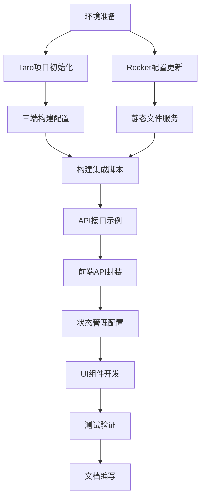

# Taro + Rocket 单仓库集成方案 - 任务拆分文档

## 任务依赖图

## 原子任务列表

### 任务1: 环境准备 [前置任务: 无]

#### 输入契约
- **前置依赖**: 无
- **环境要求**: 
  - Node.js >= 16.0.0
  - Rust >= 1.70.0
  - Taro CLI >= 3.6.0
- **验证脚本**: `scripts/check-env.sh`

#### 输出契约
- **交付物**:
  - `.nvmrc` 文件 (Node版本锁定)
  - `package.json` (根目录scripts)
  - `scripts/setup.sh` (环境初始化脚本)
- **验收标准**:
  - `node --version` >= 16.0.0 ✓
  - `rustc --version` >= 1.70.0 ✓
  - `taro --version` >= 3.6.0 ✓

#### 实现约束
- **技术栈**: Shell脚本 + Node.js
- **质量标准**: 跨平台兼容 (Windows/Linux/macOS)
- **接口规范**: 标准化输出格式

---

### 任务2: Taro项目初始化 [前置任务: 任务1]

#### 输入契约
- **前置依赖**: 环境准备完成
- **模板选择**: Taro官方React模板
- **配置参数**:
  - AppID: `touristappid`
  - TypeScript: 启用
  - CSS预处理器: Sass

#### 输出契约
- **交付物**:
  - `frontend/` 目录结构
  - `frontend/package.json` (包含所有依赖)
  - `frontend/tsconfig.json`
  - `frontend/project.config.json` (小程序配置)
- **验收标准**:
  - `npm install` 成功执行
  - `taro build --type weapp` 无错误
  - `taro build --type h5` 无错误
  - `taro build --type web` 无错误

#### 实现约束
- **技术栈**: Taro 3.x + React + TypeScript
- **目录规范**: 遵循Taro官方推荐结构
- **依赖版本**: 锁定版本避免冲突

#### 依赖关系
- **后置任务**: 任务4 (三端构建配置)
- **并行任务**: 任务3 (Rocket配置更新)

---

### 任务3: Rocket配置更新 [前置任务: 任务1]

#### 输入契约
- **前置依赖**: 环境准备完成
- **现有配置**: 分析现有Rocket.toml
- **新配置需求**:
  - 静态文件服务路径
  - API路由前缀
  - 开发/生产环境区分

#### 输出契约
- **交付物**:
  - 更新后的 `Rocket.toml`
  - 新的 `src/main.rs` (静态文件服务配置)
  - `src/routes/static.rs` (静态文件路由)
- **验收标准**:
  - `cargo run` 成功启动
  - `http://localhost:8000/` 返回index.html
  - `http://localhost:8000/api/health` 返回JSON
  - 404页面正确处理

#### 实现约束
- **技术栈**: Rust + Rocket 0.5
- **质量标准**: 零运行时panic
- **接口规范**: RESTful API设计

#### 依赖关系
- **后置任务**: 任务5 (静态文件服务)
- **并行任务**: 任务2 (Taro项目初始化)

---

### 任务4: 三端构建配置 [前置任务: 任务2]

#### 输入契约
- **前置依赖**: Taro项目初始化完成
- **构建目标**:
  - Web: SPA应用
  - H5: 移动端Web
  - 小程序: 微信小程序
- **配置需求**:
  - 环境变量配置
  - 路径别名
  - 样式配置

#### 输出契约
- **交付物**:
  - `frontend/config/index.js` (基础配置)
  - `frontend/config/dev.js` (开发配置)
  - `frontend/config/prod.js` (生产配置)
  - `frontend/tailwind.config.js` (Tailwind配置)
  - `frontend/postcss.config.js` (PostCSS配置)
- **验收标准**:
  - 三端构建命令可独立执行
  - 构建产物路径正确
  - 环境变量正确注入

#### 实现约束
- **技术栈**: Taro配置系统 + Webpack
- **性能要求**: 构建时间<30秒
- **兼容性**: 支持所有目标平台

#### 依赖关系
- **后置任务**: 任务6 (构建集成脚本)

---

### 任务5: 静态文件服务 [前置任务: 任务3]

#### 输入契约
- **前置依赖**: Rocket配置更新完成
- **服务需求**:
  - SPA路由回退
  - 缓存控制
  - 压缩支持
  - 404处理

#### 输出契约
- **交付物**:
  - `src/routes/static.rs` (静态文件服务)
  - `src/middleware/cache.rs` (缓存中间件)
  - `src/middleware/compress.rs` (压缩中间件)
- **验收标准**:
  - 静态文件正确服务
  - SPA路由回退工作
  - 缓存头正确设置
  - Gzip压缩启用

#### 实现约束
- **技术栈**: Rocket 0.5 + 中间件
- **性能要求**: 静态文件响应<100ms
- **安全要求**: 路径遍历防护

#### 依赖关系
- **后置任务**: 任务6 (构建集成脚本)
- **并行任务**: 任务4 (三端构建配置)

---

### 任务6: 构建集成脚本 [前置任务: 任务4, 任务5]

#### 输入契约
- **前置依赖**: 三端构建配置 + 静态文件服务
- **集成需求**:
  - Cargo构建时触发前端构建
  - 产物自动拷贝到static目录
  - 错误处理和日志

#### 输出契约
- **交付物**:
  - `build.rs` (构建脚本)
  - `scripts/build-frontend.sh` (前端构建脚本)
  - `scripts/clean.sh` (清理脚本)
- **验收标准**:
  - `cargo build` 自动触发前端构建
  - 构建失败时提供清晰错误信息
  - 支持跳过前端构建的选项

#### 实现约束
- **技术栈**: Rust build.rs + Shell脚本
- **错误处理**: 详细的错误信息和恢复策略
- **跨平台**: Windows批处理 + Unix Shell

#### 依赖关系
- **后置任务**: 任务7 (API接口示例)

---

### 任务7: API接口示例 [前置任务: 任务6]

#### 输入契约
- **前置依赖**: 构建集成脚本完成
- **接口需求**:
  - 健康检查接口
  - 用户CRUD接口
  - 认证接口示例
  - 统一响应格式

#### 输出契约
- **交付物**:
  - `src/models/user.rs` (用户模型)
  - `src/models/response.rs` (统一响应)
  - `src/api/auth.rs` (认证接口)
  - `src/api/users.rs` (用户接口)
  - `src/api/mod.rs` (API模块入口)
- **验收标准**:
  - 所有接口可通过curl测试
  - 响应格式符合规范
  - 错误处理完整
  - 接口文档自动生成

#### 实现约束
- **技术栈**: Rocket 0.5 + Serde
- **REST规范**: 符合RESTful设计原则
- **文档**: 自动生成OpenAPI文档

#### 依赖关系
- **后置任务**: 任务8 (前端API封装)

---

### 任务8: 前端API封装 [前置任务: 任务7]

#### 输入契约
- **前置依赖**: API接口示例完成
- **封装需求**:
  - TypeScript类型定义
  - 统一的API客户端
  - 错误处理机制
  - 请求/响应拦截器

#### 输出契约
- **交付物**:
  - `frontend/src/types/api.ts` (API类型)
  - `frontend/src/utils/api.ts` (API客户端)
  - `frontend/src/utils/request.ts` (请求封装)
  - `frontend/src/utils/error.ts` (错误处理)
- **验收标准**:
  - 所有API调用类型安全
  - 错误处理用户友好
  - 支持请求取消
  - 支持loading状态

#### 实现约束
- **技术栈**: TypeScript + Fetch API
- **类型安全**: 100%类型覆盖
- **错误处理**: 统一的错误提示

#### 依赖关系
- **后置任务**: 任务9 (状态管理配置)

---

### 任务9: 状态管理配置 [前置任务: 任务8]

#### 输入契约
- **前置依赖**: 前端API封装完成
- **状态需求**:
  - 用户状态管理
  - 全局状态配置
  - 持久化存储
  - 开发工具支持

#### 输出契约
- **交付物**:
  - `frontend/src/stores/user.ts` (用户状态)
  - `frontend/src/stores/app.ts` (应用状态)
  - `frontend/src/stores/index.ts` (状态入口)
  - `frontend/src/utils/storage.ts` (存储工具)
- **验收标准**:
  - 状态变化可追踪
  - 支持时间旅行调试
  - 状态持久化工作
  - TypeScript类型完整

#### 实现约束
- **技术栈**: Zustand + Immer
- **开发体验**: Redux DevTools支持
- **性能**: 最小化重渲染

#### 依赖关系
- **后置任务**: 任务10 (UI组件开发)

---

### 任务10: UI组件开发 [前置任务: 任务9]

#### 输入契约
- **前置依赖**: 状态管理配置完成
- **组件需求**:
  - 基础UI组件
  - 页面布局组件
  - 表单组件
  - 响应式设计

#### 输出契约
- **交付物**:
  - `frontend/src/components/Layout/` (布局组件)
  - `frontend/src/components/Form/` (表单组件)
  - `frontend/src/components/Common/` (通用组件)
  - `frontend/src/pages/Home/` (首页)
  - `frontend/src/pages/User/` (用户页)
- **验收标准**:
  - 组件可复用
  - 响应式设计
  - 无障碍访问
  - 主题切换支持

#### 实现约束
- **技术栈**: React + Tailwind CSS
- **设计系统**: 统一的设计规范
- **可访问性**: WCAG 2.1标准

#### 依赖关系
- **后置任务**: 任务11 (测试验证)

---

### 任务11: 测试验证 [前置任务: 任务10]

#### 输入契约
- **前置依赖**: UI组件开发完成
- **测试需求**:
  - 单元测试
  - 集成测试
  - 端到端测试
  - 性能测试

#### 输出契约
- **交付物**:
  - `frontend/src/**/*.test.ts` (单元测试)
  - `frontend/cypress/` (E2E测试)
  - `tests/integration/` (集成测试)
  - `tests/performance/` (性能测试)
- **验收标准**:
  - 单元测试覆盖率>80%
  - E2E测试通过
  - 性能指标达标
  - 跨平台测试通过

#### 实现约束
- **前端测试**: Jest + React Testing Library
- **后端测试**: Rust内置测试框架
- **E2E测试**: Cypress
- **性能测试**: Lighthouse

#### 依赖关系
- **后置任务**: 任务12 (文档编写)

---

### 任务12: 文档编写 [前置任务: 任务11]

#### 输入契约
- **前置依赖**: 测试验证完成
- **文档需求**:
  - 项目README
  - 开发指南
  - 部署文档
  - API文档

#### 输出契约
- **交付物**:
  - `README.md` (项目说明)
  - `docs/DEVELOPMENT.md` (开发指南)
  - `docs/DEPLOYMENT.md` (部署指南)
  - `docs/API.md` (API文档)
  - `docs/TROUBLESHOOTING.md` (故障排查)
- **验收标准**:
  - 文档完整准确
  - 快速开始指南
  - 故障排查清晰
  - 示例代码可运行

#### 实现约束
- **格式**: Markdown + Mermaid图表
- **语言**: 中英文双语
- **维护**: 版本化文档

---

## 任务执行优先级

### 高优先级 (必须完成)
1. 任务1: 环境准备
2. 任务2: Taro项目初始化
3. 任务3: Rocket配置更新
4. 任务6: 构建集成脚本

### 中优先级 (核心功能)
5. 任务4: 三端构建配置
6. 任务5: 静态文件服务
7. 任务7: API接口示例
8. 任务8: 前端API封装

### 低优先级 (增强体验)
9. 任务9: 状态管理配置
10. 任务10: UI组件开发
11. 任务11: 测试验证
12. 任务12: 文档编写

## 风险评估

### 高风险任务
- **任务6**: 构建集成脚本 (跨平台兼容性)
- **任务11**: 测试验证 (覆盖所有平台)

### 中风险任务
- **任务4**: 三端构建配置 (配置复杂性)
- **任务8**: 前端API封装 (类型安全)

### 低风险任务
- **任务1**: 环境准备 (标准流程)
- **任务2**: Taro项目初始化 (官方模板)
- **任务3**: Rocket配置更新 (现有模式)

## 里程碑定义

### 里程碑1: 基础集成 (任务1-6)
- 目标: 项目可完整编译运行
- 时间: 2-3小时
- 验收: `cargo run` 成功启动

### 里程碑2: 功能完整 (任务7-10)
- 目标: 基础功能全部实现
- 时间: 4-6小时
- 验收: 三端均可正常访问

### 里程碑3: 质量达标 (任务11-12)
- 目标: 测试通过 + 文档完整
- 时间: 2-4小时
- 验收: 所有测试通过 + 文档完整