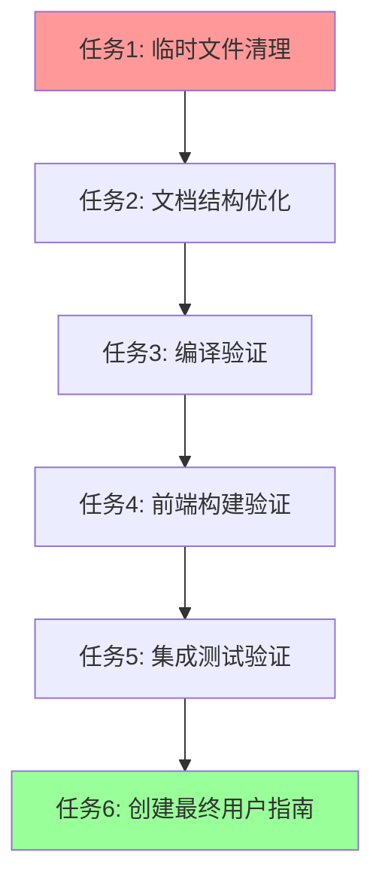

# Task3 清理原子任务清单

## 原子任务分解

### 任务1: 临时文件清理
**优先级**: 高
**复杂度**: 低
**预计时间**: 5分钟

#### 输入契约
- **前置依赖**: 无
- **文件列表**:
  - scripts/fix-windows-build.ps1
  - scripts/check-env.ps1
  - scripts/check-simple.ps1

#### 输出契约
- **交付物**: 清理后的scripts目录
- **验收标准**:
  - 临时调试脚本已删除
  - 核心构建脚本保留
  - 目录结构清晰

#### 实现约束
- **操作方式**: 直接删除文件
- **验证方式**: 检查目录内容

---

### 任务2: 文档结构优化
**优先级**: 高
**复杂度**: 中
**预计时间**: 15分钟

#### 输入契约
- **前置依赖**: 任务1完成
- **源文档**:
  - docs/windows-build-troubleshooting.md
  - docs/taro-integration/下设计文档

#### 输出契约
- **交付物**:
  - 统一的项目使用指南
  - 简化的故障排查文档
  - 更新的README.md

#### 验收标准
- [ ] 合并重复内容
- [ ] 创建用户友好的指南
- [ ] 保留关键技术信息

#### 实现约束
- **文档格式**: Markdown
- **语言**: 中英文结合
- **结构**: 层次清晰

---

### 任务3: 编译验证
**优先级**: 高
**复杂度**: 中
**预计时间**: 10分钟

#### 输入契约
- **前置依赖**: 任务1、2完成
- **验证环境**: Windows + MSVC工具链

#### 输出契约
- **交付物**: 验证报告
- **验收标准**:
  - cargo check 通过
  - cargo build 成功
  - cargo run 正常启动

#### 验证步骤
1. 清理构建缓存: cargo clean
2. 语法检查: cargo check
3. 完整构建: cargo build
4. 运行测试: cargo run (验证启动)

---

### 任务4: 前端构建验证
**优先级**: 中
**复杂度**: 中
**预计时间**: 15分钟

#### 输入契约
- **前置依赖**: Node.js环境
- **项目路径**: frontend/

#### 输出契约
- **交付物**: 前端构建验证报告
- **验收标准**:
  - npm install 成功
  - npm run build:h5 成功
  - 构建产物存在

#### 验证步骤
1. 检查前端依赖
2. 执行构建命令
3. 验证构建输出

---

### 任务5: 集成测试验证
**优先级**: 中
**复杂度**: 高
**预计时间**: 10分钟

#### 输入契约
- **前置依赖**: 任务3、4完成
- **测试环境**: 本地开发环境

#### 输出契约
- **交付物**: 集成测试报告
- **验收标准**:
  - 服务器可正常启动
  - API接口可访问
  - 静态文件服务正常

#### 测试内容
- 启动Rocket服务器
- 访问健康检查接口
- 验证静态文件服务

---

### 任务6: 创建最终用户指南
**优先级**: 高
**复杂度**: 中
**预计时间**: 20分钟

#### 输入契约
- **前置依赖**: 所有验证任务完成
- **内容来源**: 现有文档和验证结果

#### 输出契约
- **交付物**: 完整的用户使用指南
- **位置**: README.md 和 docs/

#### 指南内容
1. **快速开始** (README.md)
2. **开发指南** (docs/DEVELOPMENT.md)
3. **构建指南** (docs/BUILD.md)
4. **故障排查** (docs/TROUBLESHOOTING.md)

---

## 任务依赖关系图

## 执行顺序

### 阶段1: 清理 (任务1-2)
- 删除临时文件
- 优化文档结构

### 阶段2: 验证 (任务3-5)
- 编译验证
- 前端构建验证
- 集成测试验证

### 阶段3: 文档 (任务6)
- 创建最终用户指南
- 更新项目文档

## 风险评估

### 低风险任务
- 任务1: 临时文件清理
- 任务3: 编译验证

### 中风险任务
- 任务2: 文档结构优化
- 任务4: 前端构建验证

### 高风险任务
- 任务5: 集成测试验证
- 任务6: 创建最终用户指南

### 风险缓解措施
- 保留git提交记录
- 关键操作前创建备份
- 逐步验证每个步骤