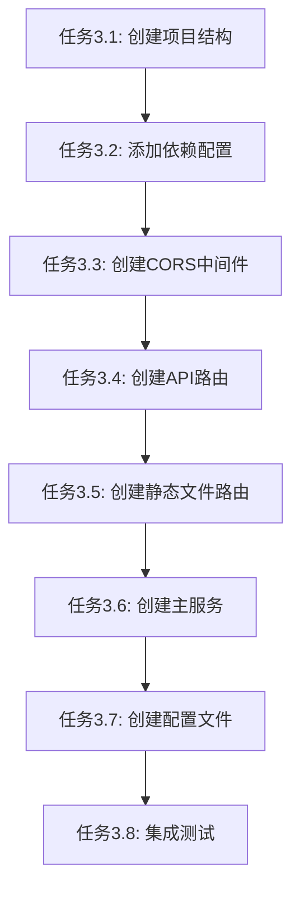

# 任务3: Rocket配置更新 - 原子任务分解

## 任务依赖图



## 原子任务列表

### 任务3.1: 创建项目结构
**优先级**: P0 (最高)
**预估时间**: 5分钟

#### 输入契约
- **前置条件**: 项目根目录存在
- **环境要求**: Rust环境已配置
- **工具要求**: cargo命令可用

#### 输出契约
- **交付物**: 标准Rust项目目录结构
- **验收标准**: 
  - `src/` 目录创建完成
  - 子模块目录结构清晰
  - 符合Rust项目规范

#### 实现约束
- **技术栈**: 标准Rust项目结构
- **命名规范**: 遵循Rust命名约定
- **目录结构**:
  ```
  src/
  ├── main.rs
  ├── routes/
  │   ├── mod.rs
  │   └── api.rs
  ├── fairings/
  │   └── cors.rs
  └── models/
      └── response.rs
  ```

#### 依赖关系
- **后置任务**: 任务3.2 (添加依赖配置)

---

### 任务3.2: 添加依赖配置
**优先级**: P0
**预估时间**: 5分钟

#### 输入契约
- **前置条件**: 任务3.1完成
- **环境要求**: cargo命令可用

#### 输出契约
- **交付物**: 更新后的Cargo.toml
- **验收标准**:
  - 所有依赖正确添加
  - 版本兼容无冲突
  - 可以成功编译

#### 实现约束
- **依赖列表**:
  ```toml
  [dependencies]
  rocket = "0.5"
  rocket_cors = "0.6"
  serde = { version = "1.0", features = ["derive"] }
  serde_json = "1.0"
  ```

#### 依赖关系
- **前置任务**: 任务3.1
- **后置任务**: 任务3.3

---

### 任务3.3: 创建CORS中间件
**优先级**: P0
**预估时间**: 10分钟

#### 输入契约
- **前置条件**: 任务3.2完成，依赖已安装
- **环境要求**: Rust编译环境

#### 输出契约
- **交付物**: `src/fairings/cors.rs`
- **验收标准**:
  - CORS配置正确
  - 支持开发环境所有来源
  - 支持生产环境配置
  - 测试通过

#### 实现约束
- **技术规范**: 使用rocket_cors库
- **配置参数**:
  - 允许方法: GET, POST, PUT, DELETE, OPTIONS
  - 允许头部: Content-Type, Authorization
  - 允许来源: 开发环境所有，生产环境可配置

#### 依赖关系
- **前置任务**: 任务3.2
- **后置任务**: 任务3.4

---

### 任务3.4: 创建API路由
**优先级**: P0
**预估时间**: 15分钟

#### 输入契约
- **前置条件**: 任务3.3完成
- **环境要求**: Rocket服务框架

#### 输出契约
- **交付物**: 
  - `src/routes/mod.rs`
  - `src/routes/api.rs`
  - `src/models/response.rs`
- **验收标准**:
  - API路由响应正确格式
  - 健康检查端点可访问
  - 统一响应模型
  - 错误处理完善

#### 实现约束
- **API规范**:
  - 基础路径: `/api`
  - 健康检查: `GET /api/health`
  - 用户API: `GET /api/user`
  - 响应格式: JSON统一格式

#### 依赖关系
- **前置任务**: 任务3.3
- **后置任务**: 任务3.5

---

### 任务3.5: 创建静态文件路由
**优先级**: P0
**预估时间**: 10分钟

#### 输入契约
- **前置条件**: 任务3.4完成
- **环境要求**: Rocket文件服务
- **前置条件**: Taro构建目录存在

#### 输出契约
- **交付物**: 静态文件路由配置
- **验收标准**:
  - 静态文件服务正常工作
  - SPA回退机制
  - 缓存策略正确
  - 路径安全

#### 实现约束
- **配置参数**:
  - 根目录: `frontend/dist/`
  - 回退文件: `index.html`
  - 缓存控制: 生产环境缓存，开发环境无缓存

#### 依赖关系
- **前置任务**: 任务3.4
- **后置任务**: 任务3.6

---

### 任务3.6: 创建主服务
**优先级**: P0
**预估时间**: 10分钟

#### 输入契约
- **前置条件**: 任务3.5完成
- **环境要求**: 所有组件已就绪

#### 输出契约
- **交付物**: `src/main.rs`
- **验收标准**:
  - 服务能正常启动
  - 所有路由注册正确
  - 中间件配置正确
  - 日志输出正常

#### 实现约束
- **服务配置**:
  - 端口: 8000
  - 地址: 0.0.0.0
  - 日志级别: 开发debug，生产info

#### 依赖关系
- **前置任务**: 任务3.5
- **后置任务**: 任务3.7

---

### 任务3.7: 创建配置文件
**优先级**: P1
**预估时间**: 5分钟

#### 输入契约
- **前置条件**: 任务3.6完成
- **环境要求**: Rocket配置系统

#### 输出契约
- **交付物**: `Rocket.toml`
- **验收标准**:
  - 环境配置分离
  - 参数可配置
  - 文档清晰

#### 实现约束
- **配置内容**:
  - 默认配置
  - 开发环境配置
  - 生产环境配置

#### 依赖关系
- **前置任务**: 任务3.6
- **后置任务**: 任务3.8

---

### 任务3.8: 集成测试
**优先级**: P1
**预估时间**: 10分钟

#### 输入契约
- **前置条件**: 所有前置任务完成
- **环境要求**: 完整服务环境

#### 输出契约
- **交付物**: 测试验证报告
- **验收标准**:
  - 服务启动测试通过
  - API测试通过
  - 静态文件测试通过
  - CORS测试通过

#### 实现约束
- **测试内容**:
  - 健康检查端点
  - 静态文件访问
  - API响应格式
  - 跨域请求

#### 依赖关系
- **前置任务**: 任务3.7

## 执行计划

### 阶段1: 基础设施 (任务3.1-3.2)
- 创建项目结构
- 添加依赖配置
- 验证编译环境

### 阶段2: 核心功能 (任务3.3-3.6)
- 实现CORS中间件
- 创建API路由
- 配置静态文件服务
- 集成主服务

### 阶段3: 配置优化 (任务3.7-3.8)
- 创建配置文件
- 集成测试验证
- 文档完善

## 风险缓解

### 技术风险
- **依赖冲突**: 使用兼容版本，逐步升级
- **路径问题**: 使用绝对路径和相对路径结合
- **CORS配置**: 开发环境宽松，生产环境严格

### 集成风险
- **构建流程**: 前后端构建顺序明确
- **端口冲突**: 使用可配置端口
- **环境差异**: 开发/生产环境配置分离