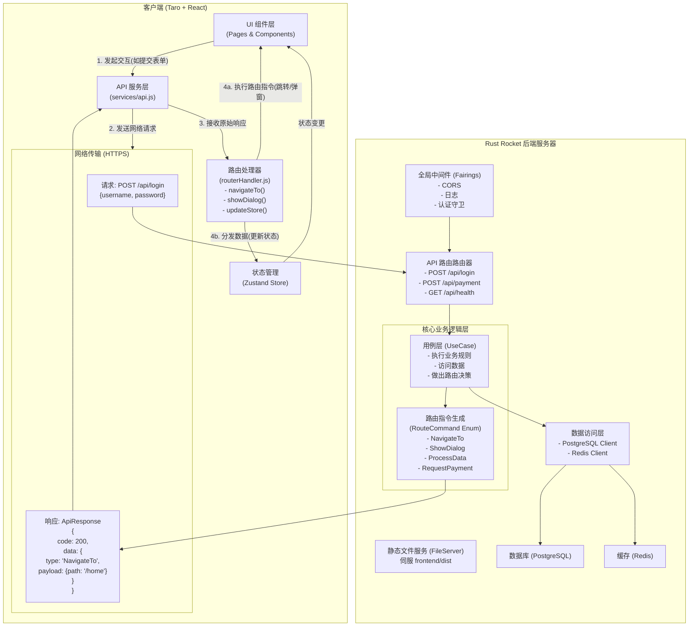

# 后端驱动路由架构设计

## 概述

后端驱动路由机制是一种现代化的前后端交互架构，它将业务流程的控制权从前端转移到后端，实现了真正的业务逻辑集中化管理。在这种架构下，前端不再负责复杂的业务决策，而是作为一个"执行器"来响应后端发送的路由指令。

## 核心理念

### 传统前端驱动 vs 后端驱动

**传统前端驱动模式**：
```javascript
// 前端需要处理复杂的业务逻辑
if (loginResponse.success) {
  if (user.isFirstLogin) {
    navigateTo('/onboarding')
  } else if (user.hasUnfinishedOrder) {
    navigateTo('/payment')
  } else if (user.isVIP) {
    navigateTo('/vip-dashboard')
  } else {
    navigateTo('/home')
  }
}
```

**后端驱动模式**：
```javascript
// 前端只需执行后端的指令
const response = await api.login(credentials)
routerHandler.execute(response.data.routeCommand)
```

### 架构优势

1. **业务逻辑集中化**：所有业务规则由后端统一管理
2. **多端一致性**：H5、小程序、APP执行相同的业务流程
3. **动态流程控制**：后端可以实时调整用户体验流程
4. **降低前端复杂度**：前端专注于UI展示和用户交互
5. **易于测试和维护**：业务逻辑测试集中在后端

## 系统架构图



## 核心组件设计

### 1. 路由指令（RouteCommand）

路由指令是后端与前端通信的核心协议，定义了前端应该执行的操作类型和相关数据。

```rust
#[derive(Debug, Serialize, Deserialize)]
#[serde(tag = "type", content = "payload")]
pub enum RouteCommand {
    /// 页面导航
    NavigateTo {
        path: String,
        params: Option<serde_json::Value>,
        replace: Option<bool>,
    },
    
    /// 显示对话框/弹窗
    ShowDialog {
        dialog_type: DialogType,
        title: String,
        content: String,
        actions: Vec<DialogAction>,
    },
    
    /// 处理数据（更新状态）
    ProcessData {
        data_type: String,
        data: serde_json::Value,
        merge: Option<bool>,
    },
    
    /// 请求支付
    RequestPayment {
        payment_info: PaymentInfo,
        callback_url: String,
    },
    
    /// 组合指令（按顺序执行多个指令）
    Sequence {
        commands: Vec<RouteCommand>,
    },
    
    /// 条件指令（根据前端状态决定执行哪个指令）
    Conditional {
        condition: String,
        if_true: Box<RouteCommand>,
        if_false: Option<Box<RouteCommand>>,
    },
}
```

### 2. 用例层（UseCase）

用例层是业务逻辑的核心，负责处理业务规则并生成相应的路由指令。

```rust
pub trait UseCase<Input, Output> {
    async fn execute(&self, input: Input) -> Result<RouteCommand, UseCaseError>;
}

pub struct AuthUseCase {
    db_pool: Arc<DbPool>,
    redis_pool: Arc<RedisPool>,
}

impl UseCase<LoginRequest, LoginResponse> for AuthUseCase {
    async fn execute(&self, request: LoginRequest) -> Result<RouteCommand, UseCaseError> {
        // 1. 验证用户凭据
        let user = self.authenticate_user(&request).await?;
        
        // 2. 创建会话
        let session = self.create_session(&user).await?;
        
        // 3. 决定下一步操作
        let route_command = self.determine_next_action(&user).await?;
        
        Ok(route_command)
    }
}

impl AuthUseCase {
    async fn determine_next_action(&self, user: &User) -> Result<RouteCommand, UseCaseError> {
        if user.is_first_login {
            Ok(RouteCommand::NavigateTo {
                path: "/onboarding".to_string(),
                params: None,
                replace: Some(true),
            })
        } else if self.has_unfinished_order(user).await? {
            Ok(RouteCommand::NavigateTo {
                path: "/payment".to_string(),
                params: Some(json!({"order_id": user.last_order_id})),
                replace: Some(true),
            })
        } else {
            Ok(RouteCommand::Sequence {
                commands: vec![
                    RouteCommand::ProcessData {
                        data_type: "user".to_string(),
                        data: serde_json::to_value(user)?,
                        merge: Some(false),
                    },
                    RouteCommand::NavigateTo {
                        path: "/home".to_string(),
                        params: None,
                        replace: Some(true),
                    },
                ],
            })
        }
    }
}
```

### 3. 前端路由处理器（RouterHandler）

前端路由处理器负责解析和执行后端发送的路由指令。

```javascript
class RouterHandler {
    constructor(store) {
        this.store = store
    }

    async execute(routeCommand) {
        switch (routeCommand.type) {
            case 'NavigateTo':
                return this.handleNavigateTo(routeCommand.payload)
            
            case 'ShowDialog':
                return this.handleShowDialog(routeCommand.payload)
            
            case 'ProcessData':
                return this.handleProcessData(routeCommand.payload)
            
            case 'RequestPayment':
                return this.handleRequestPayment(routeCommand.payload)
            
            case 'Sequence':
                return this.handleSequence(routeCommand.payload)
            
            case 'Conditional':
                return this.handleConditional(routeCommand.payload)
            
            default:
                console.warn('Unknown route command type:', routeCommand.type)
        }
    }

    async handleNavigateTo({ path, params, replace }) {
        const url = params ? `${path}?${new URLSearchParams(params)}` : path
        
        if (replace) {
            await Taro.redirectTo({ url })
        } else {
            await Taro.navigateTo({ url })
        }
    }

    async handleProcessData({ data_type, data, merge }) {
        switch (data_type) {
            case 'user':
                if (merge) {
                    this.store.updateUser(data)
                } else {
                    this.store.setUser(data)
                }
                break
            
            case 'userList':
                this.store.setUserList(data)
                break
            
            default:
                console.warn('Unknown data type:', data_type)
        }
    }

    async handleSequence({ commands }) {
        for (const command of commands) {
            await this.execute(command)
        }
    }
}
```

## 数据流详解

### 完整的用户登录流程

1. **用户交互**：用户在登录页面输入用户名和密码，点击登录按钮

2. **API调用**：前端调用登录API
   ```javascript
   const response = await api.post('/api/auth/login', { username, password })
   ```

3. **后端处理**：
   - 路由层接收请求
   - 调用 `AuthUseCase.execute()`
   - 验证用户凭据
   - 创建用户会话
   - 根据用户状态决定下一步操作
   - 生成对应的 `RouteCommand`

4. **响应生成**：
   ```json
   {
     "code": 200,
     "message": "success",
     "data": {
       "type": "Sequence",
       "payload": {
         "commands": [
           {
             "type": "ProcessData",
             "payload": {
               "data_type": "user",
               "data": { "id": 1, "username": "admin", "email": "admin@example.com" },
               "merge": false
             }
           },
           {
             "type": "NavigateTo",
             "payload": {
               "path": "/home",
               "params": null,
               "replace": true
             }
           }
         ]
       }
     }
   }
   ```

5. **前端执行**：
   - API服务层接收响应
   - 将 `RouteCommand` 传递给路由处理器
   - 路由处理器解析并执行指令序列：
     - 更新用户状态到Store
     - 跳转到首页

### 支付流程示例

对于复杂的支付流程，后端可以根据不同条件返回不同的路由指令：

```rust
async fn handle_payment_request(&self, request: PaymentRequest) -> Result<RouteCommand, Error> {
    let user = self.get_user(request.user_id).await?;
    
    if user.balance >= request.amount {
        // 余额充足，直接处理
        self.process_payment(&request).await?;
        Ok(RouteCommand::NavigateTo {
            path: "/payment-success".to_string(),
            params: Some(json!({"order_id": request.order_id})),
            replace: Some(true),
        })
    } else {
        // 余额不足，引导充值
        Ok(RouteCommand::ShowDialog {
            dialog_type: DialogType::Confirm,
            title: "余额不足".to_string(),
            content: "您的余额不足，是否前往充值？".to_string(),
            actions: vec![
                DialogAction {
                    text: "取消".to_string(),
                    action: None,
                },
                DialogAction {
                    text: "去充值".to_string(),
                    action: Some(RouteCommand::NavigateTo {
                        path: "/recharge".to_string(),
                        params: Some(json!({"required_amount": request.amount - user.balance})),
                        replace: Some(false),
                    }),
                },
            ],
        })
    }
}
```

## 架构对比分析

### 传统架构的问题

1. **业务逻辑分散**：前端、后端都有业务判断逻辑
2. **多端不一致**：H5和小程序可能有不同的业务流程
3. **维护困难**：业务规则变更需要同时修改前后端
4. **测试复杂**：需要分别测试前后端的业务逻辑

### 后端驱动架构的优势

1. **统一的业务控制**：所有业务决策都在后端
2. **强一致性**：所有端都执行相同的业务流程
3. **灵活的流程控制**：后端可以动态调整用户体验
4. **简化的前端逻辑**：前端专注于UI和交互
5. **集中的测试策略**：主要业务逻辑测试在后端完成

## 实施注意事项

### 1. 渐进式迁移

不建议一次性重构整个系统，推荐按模块逐步迁移：

1. 先选择一个相对独立的功能模块（如用户认证）
2. 实现完整的后端驱动流程
3. 验证效果后逐步扩展到其他模块

### 2. 错误处理策略

```rust
#[derive(Debug, Serialize, Deserialize)]
pub struct ErrorRouteCommand {
    pub error_code: String,
    pub error_message: String,
    pub fallback_command: Option<RouteCommand>,
}
```

### 3. 调试和监控

- 在开发环境提供详细的路由指令日志
- 实现路由指令的执行链追踪
- 建立前后端路由指令的一致性验证机制

### 4. 性能考虑

- 合理使用 `Sequence` 指令，避免过长的指令链
- 对频繁使用的路由指令进行缓存
- 实现路由指令的批量执行优化

## 总结

后端驱动路由架构是一种面向未来的系统设计理念，它通过将业务控制权集中到后端，实现了真正的业务逻辑统一管理。这种架构特别适合于：

- 多端应用（H5、小程序、APP）
- 复杂的业务流程（支付、审批等）
- 需要频繁调整用户体验的产品
- 对一致性要求较高的系统

通过合理的设计和实施，这种架构可以显著提升开发效率、系统可维护性和用户体验的一致性。