# 后端驱动路由架构设计

## 概述

后端驱动路由机制是一种现代化的前后端交互架构，它将业务流程的控制权从前端转移到后端，实现了真正的业务逻辑集中化管理。在这种架构下，前端不再负责复杂的业务决策，而是作为一个"执行器"来响应后端发送的路由指令。

## 核心理念

### 传统前端驱动 vs 后端驱动

**传统前端驱动模式**：
```javascript
// 前端需要处理复杂的业务逻辑
if (loginResponse.success) {
  if (user.isFirstLogin) {
    navigateTo('/onboarding')
  } else if (user.hasUnfinishedOrder) {
    navigateTo('/payment')
  } else if (user.isVIP) {
    navigateTo('/vip-dashboard')
  } else {
    navigateTo('/home')
  }
}
```

**后端驱动模式**：
```javascript
// 前端只需执行后端的指令
const response = await api.login(credentials)
routerHandler.execute(response.data.routeCommand)
```

### 架构优势

1. **业务逻辑集中化**：所有业务规则由后端统一管理
2. **多端一致性**：H5、小程序、APP执行相同的业务流程
3. **动态流程控制**：后端可以实时调整用户体验流程
4. **降低前端复杂度**：前端专注于UI展示和用户交互
5. **易于测试和维护**：业务逻辑测试集中在后端

## 系统架构图

```mermaid
flowchart TD
    subgraph Client["客户端 (Taro + React)"]
        direction TB
        UI["UI 组件层<br/>(Pages & Components)"]
        Store["状态管理<br/>(Zustand Store)"]
        APIService["API 服务层<br>(services/api.js)"]
        RouterHandler["路由处理器<br>(routerHandler.js)<br/>- navigateTo()<br/>- showDialog()<br/>- updateStore()"]

        UI -- "1. 发起交互(如提交表单)" --> APIService
        APIService -- "2. 发送网络请求" --> Network
        APIService -- "3. 接收原始响应" --> RouterHandler
        RouterHandler -- "4a. 执行路由指令(跳转/弹窗)" --> UI
        RouterHandler -- "4b. 分发数据(更新状态)" --> Store
        Store -- "状态变更" --> UI
    end

    subgraph Network["网络传输 (HTTPS)"]
        HTTPRequest["请求: POST /api/login<br/>{username, password}"]
        HTTPResponse["响应: ApiResponse<RouteCommand><br/>{<br/>code: 200,<br/>data: {<br/>type: 'NavigateTo',<br/>payload: {path: '/home'}<br/>}<br/>}"]
    end

    subgraph Server["Rust Rocket 后端服务器"]
        direction TB
        Fairing["全局中间件 (Fairings)<br/>- CORS<br/>- 日志<br/>- 认证守卫"]
        Router["API 路由路由器<br/>- POST /api/login<br/>- POST /api/payment<br/>- GET /api/health"]
        StaticServer["静态文件服务 (FileServer)<br/>伺服 frontend/dist"]

        subgraph CoreLogic["核心业务逻辑层"]
            UseCase["用例层 (UseCase)<br/>- 执行业务规则<br/>- 访问数据<br/>- 做出路由决策"]
            RouteCommandGen["路由指令生成<br/>(RouteCommand Enum)<br/>- NavigateTo<br/>- ShowDialog<br/>- ProcessData<br/>- RequestPayment"]
        end

        DataAccess["数据访问层<br/>- PostgreSQL Client<br/>- Redis Client"]
        DB["数据库 (PostgreSQL)"]
        Cache["缓存 (Redis)"]

        Fairing --> Router
        Router --> UseCase
        UseCase --> DataAccess
        DataAccess --> DB
        DataAccess --> Cache
        UseCase --> RouteCommandGen
        RouteCommandGen --> HTTPResponse
    end

    HTTPRequest --> Router
    HTTPResponse --> APIService
```



## 核心组件设计

### 1. 路由指令（RouteCommand）

路由指令是后端与前端通信的核心协议，定义了前端应该执行的操作类型和相关数据。

```rust
#[derive(Debug, Serialize, Deserialize)]
#[serde(tag = "type", content = "payload")]
pub enum RouteCommand {
    /// 页面导航
    NavigateTo {
        path: String,
        params: Option<serde_json::Value>,
        replace: Option<bool>,
    },
    
    /// 显示对话框/弹窗
    ShowDialog {
        dialog_type: DialogType,
        title: String,
        content: String,
        actions: Vec<DialogAction>,
    },
    
    /// 处理数据（更新状态）
    ProcessData {
        data_type: String,
        data: serde_json::Value,
        merge: Option<bool>,
    },
    
    
    /// 组合指令（按顺序执行多个指令）
    Sequence {
        commands: Vec<RouteCommand>,
        stop_on_error: Option<bool>,
    },
    
    /// 条件指令（根据前端状态决定执行哪个指令）
    Conditional {
        condition: String,
        if_true: Box<RouteCommand>,
        if_false: Option<Box<RouteCommand>>,
    },
    
    /// 延迟指令（在指定时间后执行指令）
    Delay {
        duration_ms: u64,
        command: Box<RouteCommand>,
    },
    
    /// 并行指令（同时执行多个指令）
    Parallel {
        commands: Vec<RouteCommand>,
        wait_for_all: bool,
    },
    
    /// 重试指令（使用退避策略重试指令执行）
    Retry {
        command: Box<RouteCommand>,
        max_attempts: u32,
        delay_ms: u64,
    },
}
```

### 2. 用例层（UseCase）

用例层是业务逻辑的核心，负责处理业务规则并生成相应的路由指令。

```rust
pub trait UseCase<Input, Output> {
    async fn execute(&self, input: Input) -> Result<RouteCommand, UseCaseError>;
}

pub struct AuthUseCase {
    db_pool: Arc<DbPool>,
    redis_pool: Arc<RedisPool>,
}

impl UseCase<LoginRequest, LoginResponse> for AuthUseCase {
    async fn execute(&self, request: LoginRequest) -> Result<RouteCommand, UseCaseError> {
        // 1. 验证用户凭据
        let user = self.authenticate_user(&request).await?;
        
        // 2. 创建会话
        let session = self.create_session(&user).await?;
        
        // 3. 决定下一步操作
        let route_command = self.determine_next_action(&user).await?;
        
        Ok(route_command)
    }
}

impl AuthUseCase {
    async fn determine_next_action(&self, user: &User) -> Result<RouteCommand, UseCaseError> {
        if user.is_first_login {
            Ok(RouteCommand::NavigateTo {
                path: "/onboarding".to_string(),
                params: None,
                replace: Some(true),
            })
        } else if self.has_unfinished_order(user).await? {
            Ok(RouteCommand::NavigateTo {
                path: "/payment".to_string(),
                params: Some(json!({"order_id": user.last_order_id})),
                replace: Some(true),
            })
        } else {
            Ok(RouteCommand::Sequence {
                commands: vec![
                    RouteCommand::ProcessData {
                        data_type: "user".to_string(),
                        data: serde_json::to_value(user)?,
                        merge: Some(false),
                    },
                    RouteCommand::NavigateTo {
                        path: "/home".to_string(),
                        params: None,
                        replace: Some(true),
                    },
                ],
            })
        }
    }
}
```

### 3. 前端路由处理器（RouterHandler）

前端路由处理器负责解析和执行后端发送的路由指令。

```javascript
class RouterHandler {
    constructor(store) {
        this.store = store
    }

    async execute(routeCommand) {
        switch (routeCommand.type) {
            case 'NavigateTo':
                return this.handleNavigateTo(routeCommand.payload)
            
            case 'ShowDialog':
                return this.handleShowDialog(routeCommand.payload)
            
            case 'ProcessData':
                return this.handleProcessData(routeCommand.payload)
            
            case 'RequestPayment':
                return this.handleRequestPayment(routeCommand.payload)
            
            case 'Sequence':
                return this.handleSequence(routeCommand.payload)
            
            case 'Conditional':
                return this.handleConditional(routeCommand.payload)
            
            default:
                console.warn('Unknown route command type:', routeCommand.type)
        }
    }

    async handleNavigateTo({ path, params, replace }) {
        const url = params ? `${path}?${new URLSearchParams(params)}` : path
        
        if (replace) {
            await Taro.redirectTo({ url })
        } else {
            await Taro.navigateTo({ url })
        }
    }

    async handleProcessData({ data_type, data, merge }) {
        switch (data_type) {
            case 'user':
                if (merge) {
                    this.store.updateUser(data)
                } else {
                    this.store.setUser(data)
                }
                break
            
            case 'userList':
                this.store.setUserList(data)
                break
            
            default:
                console.warn('Unknown data type:', data_type)
        }
    }

    async handleSequence({ commands }) {
        for (const command of commands) {
            await this.execute(command)
        }
    }
}
```

## 数据流详解

### 完整的用户登录流程

1. **用户交互**：用户在登录页面输入用户名和密码，点击登录按钮

2. **API调用**：前端调用登录API
   ```javascript
   const response = await api.post('/api/auth/login', { username, password })
   ```

3. **后端处理**：
   - 路由层接收请求
   - 调用 `AuthUseCase.execute()`
   - 验证用户凭据
   - 创建用户会话
   - 根据用户状态决定下一步操作
   - 生成对应的 `RouteCommand`

4. **响应生成**：
   ```json
   {
     "code": 200,
     "message": "success",
     "data": {
       "type": "Sequence",
       "payload": {
         "commands": [
           {
             "type": "ProcessData",
             "payload": {
               "data_type": "user",
               "data": { "id": 1, "username": "admin", "email": "admin@example.com" },
               "merge": false
             }
           },
           {
             "type": "NavigateTo",
             "payload": {
               "path": "/home",
               "params": null,
               "replace": true
             }
           }
         ]
       }
     }
   }
   ```

5. **前端执行**：
   - API服务层接收响应
   - 将 `RouteCommand` 传递给路由处理器
   - 路由处理器解析并执行指令序列：
     - 更新用户状态到Store
     - 跳转到首页

### 支付流程示例

对于复杂的支付流程，后端可以根据不同条件返回不同的路由指令：

```rust
async fn handle_payment_request(&self, request: PaymentRequest) -> Result<RouteCommand, Error> {
    let user = self.get_user(request.user_id).await?;
    
    if user.balance >= request.amount {
        // 余额充足，直接处理
        self.process_payment(&request).await?;
        Ok(RouteCommand::NavigateTo {
            path: "/payment-success".to_string(),
            params: Some(json!({"order_id": request.order_id})),
            replace: Some(true),
        })
    } else {
        // 余额不足，引导充值
        Ok(RouteCommand::ShowDialog {
            dialog_type: DialogType::Confirm,
            title: "余额不足".to_string(),
            content: "您的余额不足，是否前往充值？".to_string(),
            actions: vec![
                DialogAction {
                    text: "取消".to_string(),
                    action: None,
                },
                DialogAction {
                    text: "去充值".to_string(),
                    action: Some(RouteCommand::NavigateTo {
                        path: "/recharge".to_string(),
                        params: Some(json!({"required_amount": request.amount - user.balance})),
                        replace: Some(false),
                    }),
                },
            ],
        })
    }
}
```

## 架构增强 v2.0 (2024年8月)

### 版本控制与兼容性系统

架构现在支持版本化路由指令和自动回退机制：

```rust
#[derive(Debug, Clone, Serialize, Deserialize)]
pub struct VersionedRouteCommand {
    #[serde(default = "default_version")]
    pub version: u32,
    #[serde(flatten)]
    pub command: RouteCommand,
    pub fallback: Option<Box<VersionedRouteCommand>>,
    #[serde(default)]
    pub metadata: RouteCommandMetadata,
}

#[derive(Debug, Clone, Serialize, Deserialize)]
pub struct RouteCommandMetadata {
    pub timeout_ms: Option<u64>,
    pub priority: Option<u8>,
    pub execution_context: HashMap<String, serde_json::Value>,
}
```

#### 版本兼容性检查

前端自动验证指令版本：

```javascript
class RouterHandler {
    checkVersionCompatibility(serverVersion) {
        const serverMajor = Math.floor(serverVersion / 100)
        const clientMajor = Math.floor(ROUTE_COMMAND_VERSION / 100)
        return serverMajor === clientMajor
    }
    
    async executeVersionedCommand(versionedCommand) {
        const { version, command, fallback } = versionedCommand
        
        if (!this.checkVersionCompatibility(version)) {
            if (fallback) {
                console.log('由于版本不兼容，执行回退指令')
                await this.execute(fallback)
                return
            }
            throw new Error(`不支持的路由指令版本: ${version}`)
        }
        
        await this.executeCommand(command)
    }
}
```

### 增强指令类型

#### 1. 延迟指令
精确时间控制的指令执行：

```rust
RouteCommand::Delay {
    duration_ms: 2000,
    command: Box::new(RouteCommand::NavigateTo {
        path: "/delayed-page".to_string(),
        params: None,
        replace: None,
    }),
}
```

#### 2. 并行指令
同时执行多个指令：

```rust
RouteCommand::Parallel {
    commands: vec![
        RouteCommand::ProcessData { /* 更新用户数据 */ },
        RouteCommand::ProcessData { /* 更新通知数据 */ },
        RouteCommand::ProcessData { /* 更新设置数据 */ },
    ],
    wait_for_all: true,
}
```

#### 3. 重试指令
指数退避的自动重试：

```rust
RouteCommand::Retry {
    command: Box::new(RouteCommand::NavigateTo {
        path: "/critical-page".to_string(),
        params: None,
        replace: None,
    }),
    max_attempts: 3,
    delay_ms: 1000,
}
```

#### 4. 增强条件指令
运行时条件评估与安全表达式解析：

```rust
RouteCommand::Conditional {
    condition: "user && user.is_admin".to_string(),
    if_true: Box::new(RouteCommand::NavigateTo {
        path: "/admin-dashboard".to_string(),
        params: None,
        replace: Some(true),
    }),
    if_false: Some(Box::new(RouteCommand::NavigateTo {
        path: "/user-dashboard".to_string(),
        params: None,
        replace: Some(true),
    })),
}
```

### 业务逻辑分离

#### 路由指令生成器模式

```rust
pub struct RouteCommandGenerator;

impl RouteCommandGenerator {
    #[instrument(skip_all)]
    pub fn generate_login_route_command(result: &LoginResult) -> RouteCommand {
        info!(user_id = %result.user.id, "生成登录路由指令");
        
        if result.is_first_login {
            RouteCommand::Sequence {
                commands: vec![
                    RouteCommand::ProcessData {
                        data_type: "user".to_string(),
                        data: serde_json::to_value(&result.user).unwrap(),
                        merge: Some(false),
                    },
                    RouteCommand::NavigateTo {
                        path: "/onboarding".to_string(),
                        params: None,
                        replace: Some(true),
                    },
                ],
                stop_on_error: Some(true),
            }
        } else {
            // 正常登录流程...
        }
    }
}
```

#### 纯用例模式

```rust
impl AuthUseCase {
    /// 纯业务逻辑 - 返回业务结果
    pub async fn execute_login(&self, request: LoginRequest) -> UseCaseResult<LoginResult> {
        // 业务逻辑实现...
        let login_result = LoginResult::new(user, session)
            .with_pending_tasks(pending_tasks)
            .with_account_flags(flags);
            
        Ok(login_result)
    }
    
    /// 路由指令生成 - 分离关注点
    pub async fn handle_login(&self, request: LoginRequest) -> UseCaseResult<RouteCommand> {
        match self.execute_login(request).await {
            Ok(login_result) => {
                Ok(RouteCommandGenerator::generate_login_route_command(&login_result))
            }
            Err(e) => {
                Ok(RouteCommandGenerator::generate_error_route_command(&e.to_string(), None))
            }
        }
    }
}
```

### 全局请求拦截器

前端现在自动处理所有API响应中的路由指令：

```javascript
const request = async (url, options = {}) => {
    const response = await Taro.request(requestConfig)
    
    if (response.statusCode === 200) {
        const responseData = response.data
        
        // 🚀 全局路由指令拦截器
        if (responseData && typeof responseData === 'object') {
            const routeCommand = responseData.route_command || responseData.routeCommand
            
            if (routeCommand) {
                // 异步执行，不阻塞当前请求
                setTimeout(async () => {
                    try {
                        const store = useStore.getState()
                        const routerHandler = store.getRouterHandler()
                        
                        if (routerHandler) {
                            await routerHandler.execute(routeCommand)
                        }
                    } catch (routeError) {
                        console.error('路由指令执行失败:', routeError)
                    }
                }, 0)
            }
        }
        
        return responseData
    }
}
```

### 增强可观测性

#### 执行追踪

```javascript
class RouterHandler {
    async execute(routeCommand) {
        const executionId = this.generateExecutionId()
        const startTime = performance.now()
        
        try {
            await this.executeCommand(routeCommand, executionId)
            
            const duration = performance.now() - startTime
            this.recordExecution(executionId, routeCommand, 'success', null, { duration })
            
        } catch (error) {
            const duration = performance.now() - startTime
            this.recordExecution(executionId, routeCommand, 'error', error.message, { duration })
            
            // 生产环境自动错误报告
            if (process.env.NODE_ENV === 'production') {
                this.reportExecutionMetrics({
                    executionId,
                    commandType: routeCommand.type,
                    error: error.message,
                    duration,
                    timestamp: new Date().toISOString()
                })
            }
        }
    }
    
    getExecutionStats() {
        const total = this.executionHistory.length
        const successful = this.executionHistory.filter(r => r.status === 'success').length
        const failed = this.executionHistory.filter(r => r.status === 'error').length
        
        return {
            total,
            successful,
            failed,
            successRate: total > 0 ? (successful / total * 100).toFixed(2) + '%' : '0%',
            avgDuration: this.calculateAverageDuration(),
            commandTypes: this.getCommandTypeDistribution()
        }
    }
}
```

#### 后端指标收集

```rust
// 新的指标端点
#[post("/api/metrics/route-command-error", data = "<metric>")]
pub async fn receive_route_command_error_metric(
    metric: Json<RouteCommandErrorMetric>,
) -> Json<ApiResponse<()>> {
    error!(
        execution_id = %metric.execution_id,
        command_type = %metric.command_type,
        error_message = %metric.error,
        "收到前端路由指令执行错误"
    );
    
    // 处理指标用于监控和告警
    Json(ApiResponse::with_toast((), "指标已记录"))
}

#[post("/api/metrics/health")]
pub async fn get_system_health() -> Json<ApiResponse<SystemHealthStatus>> {
    let health_status = SystemHealthStatus {
        status: "healthy".to_string(),
        timestamp: chrono::Utc::now(),
        components: vec![
            ComponentHealth {
                name: "route_handler".to_string(),
                status: "healthy".to_string(),
                details: Some("所有路由指令正常执行".to_string()),
            },
        ],
        version: env!("CARGO_PKG_VERSION").to_string(),
    };
    
    Json(ApiResponse::success(health_status))
}
```

### 多级回退系统

#### 指令级回退
```rust
VersionedRouteCommand {
    version: 200,
    command: RouteCommand::NavigateTo { /* 高级导航 */ },
    fallback: Some(Box::new(VersionedRouteCommand {
        version: 100,
        command: RouteCommand::NavigateTo { /* 基础导航 */ },
        fallback: None,
    })),
}
```

#### 执行级回退
```javascript
async handleExecutionError(originalCommand, error, executionId) {
    const fallbackEntry = this.fallbackStack.find(entry => entry.executionId === executionId)
    
    if (fallbackEntry) {
        console.log(`由于错误执行回退指令`)
        try {
            await this.execute(fallbackEntry.fallback)
        } catch (fallbackError) {
            this.showGenericError()
        }
    }
}
```

## 架构对比分析

### 传统架构的问题

1. **业务逻辑分散**：前端、后端都有业务判断逻辑
2. **多端不一致**：H5和小程序可能有不同的业务流程
3. **维护困难**：业务规则变更需要同时修改前后端
4. **测试复杂**：需要分别测试前后端的业务逻辑

### 后端驱动架构的优势

1. **统一的业务控制**：所有业务决策都在后端
2. **强一致性**：所有端都执行相同的业务流程
3. **灵活的流程控制**：后端可以动态调整用户体验
4. **简化的前端逻辑**：前端专注于UI和交互
5. **集中的测试策略**：主要业务逻辑测试在后端完成

## 实施注意事项

### 1. 渐进式迁移

不建议一次性重构整个系统，推荐按模块逐步迁移：

1. 先选择一个相对独立的功能模块（如用户认证）
2. 实现完整的后端驱动流程
3. 验证效果后逐步扩展到其他模块

### 2. 错误处理策略

```rust
#[derive(Debug, Serialize, Deserialize)]
pub struct ErrorRouteCommand {
    pub error_code: String,
    pub error_message: String,
    pub fallback_command: Option<RouteCommand>,
}
```

### 3. 调试和监控

- 在开发环境提供详细的路由指令日志
- 实现路由指令的执行链追踪
- 建立前后端路由指令的一致性验证机制

### 4. 性能考虑

- 合理使用 `Sequence` 指令，避免过长的指令链
- 对频繁使用的路由指令进行缓存
- 实现路由指令的批量执行优化

## 总结

后端驱动路由架构是一种面向未来的系统设计理念，它通过将业务控制权集中到后端，实现了真正的业务逻辑统一管理。这种架构特别适合于：

- 多端应用（H5、小程序、APP）
- 复杂的业务流程（支付、审批等）
- 需要频繁调整用户体验的产品
- 对一致性要求较高的系统

通过合理的设计和实施，这种架构可以显著提升开发效率、系统可维护性和用户体验的一致性。