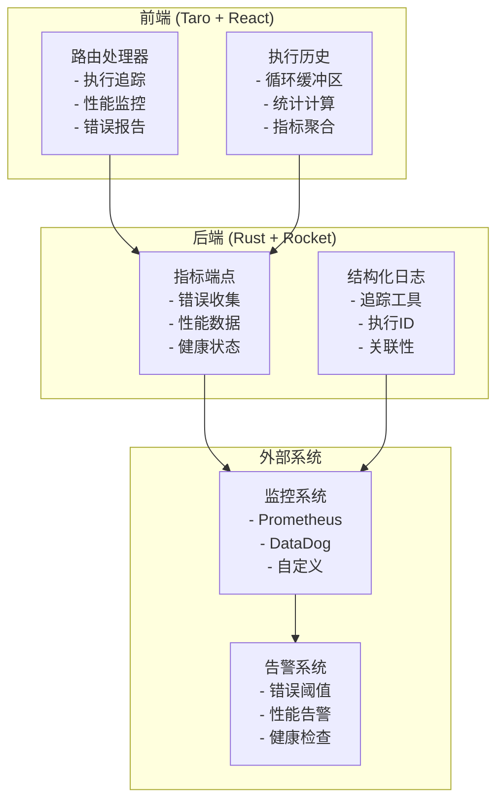

# 可观测性与监控指南

## 概述

本指南涵盖了后端驱动路由架构 v2.0 中引入的全面可观测性功能。这些功能提供了系统行为的深度洞察、性能监控、错误追踪和运营健康状况。

## 架构概览

### 可观测性组件



## 前端可观测性

### 执行追踪

每个路由指令执行都被追踪，包含唯一执行ID和全面的元数据。

#### 配置

```javascript
class RouterHandler {
    constructor(store) {
        this.store = store
        this.debugMode = process.env.NODE_ENV === 'development'
        this.executionHistory = [] // 循环缓冲区（最大100条记录）
        this.fallbackStack = []
    }
    
    // 生成唯一执行ID
    generateExecutionId() {
        return Math.random().toString(36).substr(2, 9)
    }
}
```

#### 执行元数据收集

```javascript
async execute(routeCommand) {
    const executionId = this.generateExecutionId()
    const startTime = performance.now()
    
    if (this.debugMode) {
        console.group(`🚀 RouterHandler: 执行指令 [${executionId}]`)
        console.log('输入:', routeCommand)
        console.time(`执行时间 [${executionId}]`)
    }
    
    try {
        // 带追踪的指令执行
        await this.executeCommand(routeCommand, executionId)
        
        const endTime = performance.now()
        const duration = endTime - startTime
        
        // 记录成功执行
        this.recordExecution(executionId, routeCommand, 'success', null, { duration })
        
    } catch (error) {
        const endTime = performance.now()
        const duration = endTime - startTime
        
        // 记录失败执行及错误详情
        this.recordExecution(executionId, routeCommand, 'error', error.message, { duration })
        
        // 生产环境错误报告
        if (process.env.NODE_ENV === 'production') {
            this.reportExecutionMetrics({
                executionId,
                commandType: routeCommand.type,
                error: error.message,
                duration,
                timestamp: new Date().toISOString(),
                userAgent: navigator.userAgent,
                url: window.location.href
            })
        }
        
        throw error
    } finally {
        if (this.debugMode) {
            console.timeEnd(`执行时间 [${executionId}]`)
            console.groupEnd()
        }
    }
}
```

### 性能监控

#### 执行统计

```javascript
getExecutionStats() {
    const total = this.executionHistory.length
    const successful = this.executionHistory.filter(r => r.status === 'success').length
    const failed = this.executionHistory.filter(r => r.status === 'error').length
    
    const durations = this.executionHistory
        .filter(r => r.duration !== null)
        .map(r => r.duration)
    
    const avgDuration = durations.length > 0 
        ? durations.reduce((a, b) => a + b, 0) / durations.length 
        : 0
        
    const maxDuration = durations.length > 0 ? Math.max(...durations) : 0
    
    const commandTypes = {}
    this.executionHistory.forEach(record => {
        const type = record.commandType || 'unknown'
        commandTypes[type] = (commandTypes[type] || 0) + 1
    })
    
    return {
        total,
        successful,
        failed,
        successRate: total > 0 ? (successful / total * 100).toFixed(2) + '%' : '0%',
        avgDuration: Math.round(avgDuration * 100) / 100,
        maxDuration: Math.round(maxDuration * 100) / 100,
        commandTypes,
        lastExecution: this.executionHistory.length > 0 
            ? this.executionHistory[this.executionHistory.length - 1].timestamp 
            : null
    }
}
```

#### 使用示例

```javascript
// 获取实时统计
const stats = routerHandler.getExecutionStats()
console.log('📊 路由处理器统计:', {
    '成功率': stats.successRate,
    '平均耗时': `${stats.avgDuration}ms`,
    '总指令数': stats.total,
    '指令分布': stats.commandTypes
})

// 输出示例:
// 📊 路由处理器统计: {
//   '成功率': '94.7%',
//   '平均耗时': '245.3ms', 
//   '总指令数': 38,
//   '指令分布': {
//     'NavigateTo': 15,
//     'ProcessData': 12,
//     'Sequence': 8,
//     'ShowDialog': 3
//   }
// }
```

### 错误报告

#### 自动错误报告

错误在生产环境中自动报告到后端：

```javascript
async reportExecutionMetrics(record) {
    try {
        if (typeof fetch !== 'undefined') {
            await fetch('/api/metrics/route-command-error', {
                method: 'POST',
                headers: {
                    'Content-Type': 'application/json',
                },
                body: JSON.stringify({
                    executionId: record.executionId,
                    commandType: record.commandType,
                    error: record.error,
                    duration: record.duration,
                    timestamp: record.timestamp,
                    userAgent: record.userAgent,
                    url: record.url
                })
            }).catch(error => {
                console.warn('无法报告错误指标:', error)
            })
        }
    } catch (error) {
        console.warn('指标报告失败:', error)
    }
}
```

## 后端可观测性

### 结构化日志

#### 追踪工具

所有关键函数都配备了追踪工具，用于详细的执行追踪：

```rust
use tracing::{info, warn, error, instrument};

impl AuthUseCase {
    /// 执行用户登录的全面追踪
    #[instrument(skip_all, name = "execute_login")]
    pub async fn execute_login(&self, request: LoginRequest) -> UseCaseResult<LoginResult> {
        info!("处理用户登录请求: {}", request.username);

        // 1. 用户认证
        let user = match self.authenticate_user(&request).await? {
            Some(user) => {
                info!(user_id = %user.id, username = %user.username, "用户认证成功");
                user
            },
            None => {
                warn!("用户登录失败: {} - 无效凭据", request.username);
                return Err(UseCaseError::AuthenticationError("无效凭据".to_string()));
            }
        };

        // 2. 创建会话并追踪
        let session = self.create_session(&user).await.map_err(|e| {
            error!(user_id = %user.id, error = %e, "创建会话失败");
            UseCaseError::InternalError("会话创建失败".to_string())
        })?;

        info!(
            user_id = %user.id, 
            session_id = %session.id,
            "登录成功，会话已创建"
        );

        Ok(LoginResult::new(user, session))
    }
}
```

### 指标收集端点

#### 错误指标端点

```rust
#[post("/api/metrics/route-command-error", data = "<metric>")]
#[instrument(skip_all, name = "receive_route_command_error_metric")]
pub async fn receive_route_command_error_metric(
    metric: Json<RouteCommandErrorMetric>,
) -> Json<ApiResponse<()>> {
    let metric = metric.into_inner();
    
    // 包含所有上下文的结构化错误日志
    error!(
        execution_id = %metric.execution_id,
        command_type = %metric.command_type,
        error_message = %metric.error,
        duration = ?metric.duration,
        user_agent = %metric.user_agent,
        url = %metric.url,
        timestamp = %metric.timestamp,
        "收到前端路由指令执行错误"
    );
    
    // 基于错误模式触发告警
    if metric.command_type == "NavigateTo" && metric.error.contains("Navigation failed") {
        warn!(
            execution_id = %metric.execution_id,
            "检测到高频导航错误 - 可能的路由配置问题"
        );
    }
    
    // 性能问题检测
    if let Some(duration) = metric.duration {
        if duration > 5000.0 { // 超过5秒
            warn!(
                execution_id = %metric.execution_id,
                command_type = %metric.command_type,
                duration = %duration,
                "检测到极慢的路由指令执行"
            );
        }
    }
    
    Json(ApiResponse::with_toast((), "错误指标已记录"))
}
```

### 健康监控

#### 系统健康端点

```rust
#[post("/api/metrics/health")]
#[instrument(name = "get_system_health")]
pub async fn get_system_health() -> Json<ApiResponse<SystemHealthStatus>> {
    info!("系统健康检查请求");
    
    // 检查数据库连接性
    let db_status = check_database_health().await;
    
    // 检查Redis连接性  
    let redis_status = check_redis_health().await;
    
    // 检查路由处理器状态
    let route_handler_status = check_route_handler_health().await;
    
    let overall_status = if db_status == "healthy" && 
                           redis_status == "healthy" && 
                           route_handler_status == "healthy" {
        "healthy"
    } else if db_status != "unhealthy" && 
              redis_status != "unhealthy" && 
              route_handler_status != "unhealthy" {
        "degraded"
    } else {
        "unhealthy"
    };
    
    let health_status = SystemHealthStatus {
        status: overall_status.to_string(),
        timestamp: chrono::Utc::now(),
        components: vec![
            ComponentHealth {
                name: "database".to_string(),
                status: db_status,
                last_check: chrono::Utc::now(),
                details: None,
            },
            ComponentHealth {
                name: "redis".to_string(),
                status: redis_status,
                last_check: chrono::Utc::now(),
                details: None,
            },
            ComponentHealth {
                name: "route_handler".to_string(),
                status: route_handler_status,
                last_check: chrono::Utc::now(),
                details: Some("所有路由指令正常执行".to_string()),
            },
        ],
        version: env!("CARGO_PKG_VERSION").to_string(),
    };
    
    if overall_status != "healthy" {
        warn!(
            overall_status = %overall_status,
            "系统健康检查显示降级或不健康状态"
        );
    }
    
    Json(ApiResponse::success(health_status))
}
```

## 开发和调试

### 开发模式功能

#### 增强控制台输出

```javascript
// 开发模式丰富控制台输出
if (process.env.NODE_ENV === 'development') {
    console.group(`🚀 RouterHandler: 执行指令 [${executionId}]`)
    console.log('📝 指令详情:', {
        type: routeCommand.type,
        payload: routeCommand.payload,
        timestamp: new Date().toISOString()
    })
    console.log('🔍 执行上下文:', {
        userAgent: navigator.userAgent,
        url: window.location.href,
        store: this.store
    })
    console.time(`⏱️ 执行时间 [${executionId}]`)
}
```

#### 调试工具

```javascript
// 开发调试工具
class RouterHandler {
    // ... 现有代码
    
    // 导出执行历史用于调试
    exportExecutionHistory() {
        const data = JSON.stringify(this.executionHistory, null, 2)
        const blob = new Blob([data], { type: 'application/json' })
        const url = URL.createObjectURL(blob)
        
        const a = document.createElement('a')
        a.href = url
        a.download = `router-execution-history-${Date.now()}.json`
        document.body.appendChild(a)
        a.click()
        document.body.removeChild(a)
        URL.revokeObjectURL(url)
    }
    
    // 模拟错误用于测试
    simulateError(commandType = 'NavigateTo') {
        const mockCommand = {
            type: commandType,
            payload: { path: '/test-error' }
        }
        
        const mockError = new Error('测试模拟错误')
        this.recordExecution(
            this.generateExecutionId(),
            mockCommand,
            'error',
            mockError.message,
            { duration: Math.random() * 1000 }
        )
    }
    
    // 性能测试
    async performanceTest(iterations = 100) {
        console.log(`🏃 开始性能测试，迭代次数: ${iterations}`)
        
        const results = []
        for (let i = 0; i < iterations; i++) {
            const start = performance.now()
            await this.execute({
                type: 'ProcessData',
                payload: { data_type: 'test', data: { iteration: i } }
            })
            results.push(performance.now() - start)
        }
        
        const avg = results.reduce((a, b) => a + b) / results.length
        const min = Math.min(...results)
        const max = Math.max(...results)
        
        console.log('📊 性能测试结果:', {
            iterations,
            averageTime: `${avg.toFixed(2)}ms`,
            minTime: `${min.toFixed(2)}ms`,
            maxTime: `${max.toFixed(2)}ms`
        })
        
        return { avg, min, max, results }
    }
}
```

## 最佳实践

### 可观测性实施指南

1. **结构化日志**
   - 在所有日志中使用一致的字段名
   - 包含关联ID进行请求追踪
   - 在适当的级别记录日志（info、warn、error）

2. **指标收集**
   - 收集业务和技术指标
   - 使用适当的指标类型（计数器、直方图、仪表）
   - 包含相关标签用于筛选和聚合

3. **错误追踪**
   - 按类型和严重程度分类错误
   - 包含足够的上下文用于调试
   - 实施错误预算和SLA

4. **性能监控**
   - 追踪延迟百分位数，而不仅仅是平均值
   - 监控资源利用率
   - 设置性能基线和阈值

5. **健康检查**
   - 实施全面的健康端点
   - 在整体状态中包含依赖健康
   - 提供可操作的健康信息

## 故障排除常见问题

### 高错误率

```javascript
// 调试高错误率
const errorAnalysis = routerHandler.getExecutionStats()
if (parseFloat(errorAnalysis.successRate) < 90) {
    console.warn('🚨 检测到高错误率:', {
        successRate: errorAnalysis.successRate,
        totalCommands: errorAnalysis.total,
        errorTypes: routerHandler.getErrorDistribution()
    })
    
    // 导出详细历史用于分析
    routerHandler.exportExecutionHistory()
}
```

### 性能问题

```javascript
// 性能监控和告警
const stats = routerHandler.getExecutionStats()
if (stats.avgDuration > 1000) { // 平均超过1秒
    console.warn('🐌 检测到性能降级:', {
        averageDuration: `${stats.avgDuration}ms`,
        maxDuration: `${stats.maxDuration}ms`,
        slowestCommands: routerHandler.getSlowestExecutions()
    })
    
    // 触发性能测试
    routerHandler.performanceTest(50)
}
```

这个全面的可观测性系统为后端驱动路由系统的操作提供了完整的可见性，支持主动监控、快速问题检测和数据驱动的优化决策。